**Làm chủ Quản lý Truy cập và Định danh AWS: Hướng dẫn Toàn diện**

```mermaid
graph TB
    %% Styling
    classDef entity fill:#4A90E2,stroke:#2E5C8A,stroke-width:2px,color:#fff
    classDef policy fill:#27AE60,stroke:#1E7E34,stroke-width:2px,color:#fff
    classDef process fill:#E67E22,stroke:#A0522D,stroke-width:2px,color:#fff
    classDef security fill:#E74C3C,stroke:#8B0000,stroke-width:2px,color:#fff
    classDef external fill:#9B59B6,stroke:#6B3AA0,stroke-width:2px,color:#fff

    %% Main Title
    subgraph AWS_IAM["🔐 AWS Identity and Access Management (IAM)"]
        
        %% Core Entities Section
        subgraph Entities["IAM Entities"]
            Root["Root User<br/>• Full access<br/>• Use MFA<br/>• Minimal usage"]:::security
            Users["IAM Users<br/>• Human identities<br/>• Long-term credentials<br/>• Console/API access"]:::entity
            Groups["IAM Groups<br/>• User collections<br/>• Shared permissions<br/>• No nesting"]:::entity
            Roles["IAM Roles<br/>• Temporary credentials<br/>• Cross-account access<br/>• Service permissions"]:::entity
            
            Root -->|Creates| Users
            Users -->|Member of| Groups
            Users -->|Can assume| Roles
        end

        %% Authentication Section
        subgraph Auth["Authentication Layer"]
            Creds["Credentials<br/>• Passwords<br/>• Access Keys<br/>• MFA tokens"]:::process
            AuthProcess["Authentication<br/>Process"]:::process
            SessionToken["Session Token<br/>• Temporary<br/>• Time-limited"]:::process
            
            Creds -->|Validates| AuthProcess
            AuthProcess -->|Generates| SessionToken
        end

        %% Policy Section
        subgraph Policies["Policy Framework"]
            PolicyTypes["Policy Types"]:::policy
            Managed["AWS Managed<br/>• Pre-built<br/>• Best practices<br/>• Auto-updated"]:::policy
            Customer["Customer Managed<br/>• Custom logic<br/>• Reusable<br/>• Version control"]:::policy
            Inline["Inline Policies<br/>• One-to-one<br/>• Entity specific<br/>• Not reusable"]:::policy
            
            PolicyTypes --> Managed
            PolicyTypes --> Customer
            PolicyTypes --> Inline
            
            PermBoundary["Permission Boundaries<br/>• Maximum permissions<br/>• Delegation control"]:::security
            SCP["Service Control Policies<br/>• Organization-wide<br/>• Preventive controls"]:::security
        end

        %% Policy Evaluation
        subgraph Evaluation["Policy Evaluation Logic"]
            Request["API Request"]:::process
            Deny["Explicit Deny?"]:::process
            Allow["Explicit Allow?"]:::process
            SCPCheck["SCP Allow?"]:::process
            PermCheck["Within Permission<br/>Boundary?"]:::process
            Final["Final Decision"]:::process
            
            Request --> Deny
            Deny -->|No| SCPCheck
            Deny -->|Yes| Final
            SCPCheck -->|Yes| Allow
            SCPCheck -->|No| Final
            Allow -->|Yes| PermCheck
            Allow -->|No| Final
            PermCheck -->|Yes| Final
            PermCheck -->|No| Final
        end

        %% Role Assumption Flow
        subgraph AssumeRole["Role Assumption Flow"]
            Principal["Principal<br/>(User/Service)"]:::entity
            TrustPolicy["Trust Policy<br/>Evaluation"]:::policy
            STSCall["STS AssumeRole<br/>API Call"]:::process
            TempCreds["Temporary<br/>Credentials"]:::process
            
            Principal -->|Requests| STSCall
            STSCall -->|Checks| TrustPolicy
            TrustPolicy -->|Allows| TempCreds
            TempCreds -->|Valid for| Duration["Duration<br/>• 15 min - 12 hrs<br/>• Default: 1 hr"]:::process
        end

        %% External Integration
        subgraph External["External Integration"]
            SAML["SAML 2.0<br/>Identity Provider"]:::external
            OIDC["OpenID Connect<br/>Provider"]:::external
            Federation["Federation<br/>Endpoint"]:::process
            
            SAML --> Federation
            OIDC --> Federation
            Federation -->|Maps to| Roles
        end

        %% Best Practices
        subgraph BestPractices["Security Best Practices"]
            LeastPriv["Least Privilege<br/>• Minimal permissions<br/>• Regular reviews"]:::security
            MFA["Multi-Factor Auth<br/>• Required for root<br/>• Recommended for users"]:::security
            Rotation["Credential Rotation<br/>• Access keys: 90 days<br/>• Passwords: Policy-based"]:::security
            Monitoring["Monitoring<br/>• CloudTrail logs<br/>• Access Analyzer<br/>• Unused credentials"]:::security
        end

        %% Connections between sections
        Users -.->|Authenticate with| Creds
        Groups -.->|Attach| PolicyTypes
        Users -.->|Attach| PolicyTypes
        Roles -.->|Attach| PolicyTypes
        Roles -.->|Define trust with| TrustPolicy
        
        SessionToken -.->|Used in| Request
        PolicyTypes -.->|Evaluated in| Evaluation
        PermBoundary -.->|Limits| PermCheck
        SCP -.->|Enforced in| SCPCheck
        
        External -.->|Provides| Principal
        BestPractices -.->|Applies to| Entities
        Monitoring -.->|Tracks| Auth
        Monitoring -.->|Audits| Evaluation
    end

    %% Legend
    subgraph Legend["Legend"]
        L1["Blue: IAM Entities"]:::entity
        L2["Green: Policies"]:::policy
        L3["Orange: Processes"]:::process
        L4["Red: Security Controls"]:::security
        L5["Purple: External Systems"]:::external
    end
```

**1. Giới thiệu: Vai trò Không thể Thiếu của IAM trong Bảo mật Đám mây**

Trong kiến trúc đám mây hiện đại, Quản lý Truy cập và Định danh (IAM) không chỉ đơn thuần là một tính năng mà đã trở thành nền tảng bảo mật cốt lõi của mọi môi trường Amazon Web Services (AWS). IAM đóng vai trò như một hệ thống kiểm soát truy cập trung tâm cho AWS, chịu trách nhiệm xác thực (ai đang đăng nhập?) và ủy quyền (ai được làm gì?) cho cả người dùng và dịch vụ.¹ Mục tiêu chính của IAM là thực thi **nguyên tắc đặc quyền tối thiểu**, đảm bảo mỗi định danh (người dùng hoặc dịch vụ) chỉ sở hữu những quyền hạn thực sự cần thiết để hoàn thành nhiệm vụ, không hơn không kém.¹ IAM hoạt động như người gác cổng, nơi các tổ chức định rõ ai (định danh) có thể thực hiện hành động gì trên tài nguyên nào, và trong những điều kiện cụ thể nào.² Bất kỳ cấu hình sai sót nào trong IAM đều có thể dẫn đến những hậu quả bảo mật nghiêm trọng và tức thời.

Việc triển khai IAM hiệu quả không chỉ củng cố bức tường an ninh mà còn trực tiếp thúc đẩy sự linh hoạt trong hoạt động kinh doanh. Khi quyền truy cập được kiểm soát chặt chẽ và minh bạch, các đội ngũ phát triển có thể tự tin đổi mới, triển khai tài nguyên nhanh chóng và đáp ứng các yêu cầu tuân thủ mà không tạo ra những rủi ro không đáng có. Điều này làm thay đổi nhận thức về IAM, từ một cơ chế thuần túy mang tính hạn chế trở thành một yếu tố then chốt cho các hoạt động đám mây an toàn và có khả năng mở rộng. Ví dụ, thông qua việc ủy quyền an toàn với các tính năng như **giới hạn quyền (permissions boundaries)**, bộ phận CNTT trung tâm có thể trao quyền cho các nhóm phát triển mà vẫn giữ được quyền kiểm soát, từ đó đẩy nhanh chu kỳ phát triển.³

Tuy nhiên, chính khả năng kiểm soát chi tiết và sức mạnh của IAM lại là nguồn gốc của sự phức tạp.² Nếu thiếu hiểu biết sâu sắc và quản lý cẩn trọng, sự phức tạp này có thể dẫn đến cấu hình sai, cấp quyền thừa thãi và các lỗ hổng bảo mật. Sự phát triển không ngừng của IAM, với sự ra đời của các công cụ như IAM Identity Center và các tính năng như Kiểm soát Truy cập Dựa trên Thuộc tính (ABAC), chính là nỗ lực của AWS nhằm giải quyết sự phức tạp này ở quy mô lớn.⁵

**Điều hướng Sự tiến hóa của AWS IAM: Từ Người dùng Tĩnh đến Kiểm soát Động, Lấy Định danh làm Trung tâm**

Hiểu rõ hành trình phát triển của IAM là điều vô cùng quan trọng, bởi nó giúp chúng ta nhận diện những thách thức mà mỗi tính năng hay phương pháp mới ra đời để giải quyết.⁵ Bối cảnh lịch sử này lý giải tại sao một số phương pháp thực hành tốt nhất (như ưu tiên vai trò hơn người dùng) lại tồn tại, và cách AWS đã không ngừng cải tiến việc quản lý danh tính để đáp ứng quy mô và nhu cầu bảo mật ngày càng tăng.

*   **Giai đoạn một: Người dùng IAM và Truy cập tĩnh:** Ban đầu, AWS IAM tập trung vào người dùng IAM tĩnh với thông tin xác thực dài hạn, được cấu hình và phân phối thủ công. Mô hình này, dù phù hợp với các nhóm nhỏ hoặc môi trường tài khoản đơn lẻ, nhanh chóng bộc lộ hạn chế khi quy mô tổ chức mở rộng. Hậu quả là tình trạng cấp quyền thừa thãi, vi phạm nguyên tắc đặc quyền tối thiểu, và tạo ra quyền truy cập thường trực, làm gia tăng rủi ro bảo mật. Sự lan tràn của thông tin xác thực và khả năng kiểm toán yếu kém khiến việc theo dõi và quản lý khóa truy cập trở nên vô cùng khó khăn. Thêm vào đó, chi phí vận hành cao cho các tác vụ như xoay vòng khóa, thu hồi quyền truy cập và ứng phó sự cố đã kìm hãm sự linh hoạt và khả năng giám sát, đặc biệt trong môi trường đa tài khoản.⁵

*   **Giai đoạn hai: Vai trò, STS và Truy cập Liên kết:** Để khắc phục những hạn chế của người dùng IAM tĩnh, AWS đã giới thiệu Vai trò IAM và Dịch vụ Mã thông báo Bảo mật (STS). Vai trò IAM cho phép đảm nhận thông tin xác thực tạm thời dựa trên các chính sách tin cậy, trong khi STS cung cấp quyền truy cập dựa trên phiên với thời gian giới hạn. Giai đoạn này cũng đánh dấu sự ra đời của **truy cập liên kết (federated access)**, cho phép các tổ chức kết nối Nhà cung cấp Danh tính (IdP) hiện có của họ với AWS. Điều này cải thiện đáng kể việc quản lý vòng đời truy cập, đặc biệt hữu ích khi quản lý thay đổi quyền truy cập của người dùng. An ninh được tăng cường nhờ giảm sự phụ thuộc vào thông tin xác thực dài hạn và quyền truy cập cố định. Khả năng kiểm toán cũng được cải thiện với nhật ký phiên và khả năng liên kết danh tính. Tuy nhiên, việc quản lý vai trò và mối quan hệ tin cậy trên nhiều tài khoản AWS vẫn đòi hỏi sự phối hợp phức tạp và thủ công.⁵

*   **Giai đoạn ba: AWS Organizations và Mô hình Đa tài khoản:** Khi việc sử dụng AWS ngày càng phổ biến, các tổ chức bắt đầu áp dụng chiến lược đa tài khoản với sự hỗ trợ của AWS Organizations để tách biệt khối lượng công việc, môi trường và các đơn vị kinh doanh. Mô hình này cải thiện khả năng cô lập và khả năng chịu lỗi, củng cố việc tuân thủ quy định, đồng thời cung cấp khả năng phân bổ chi phí và quản trị tốt hơn. Dù vậy, việc quản lý nhất quán các quyền trên nhiều tài khoản AWS lại trở thành một thách thức mới. Các vai trò IAM phải được sao chép và ánh xạ thủ công giữa các tài khoản, và công tác quản trị thường dựa vào các phương pháp thủ công như bảng tính. Sự phức tạp này càng làm nổi bật nhu cầu về một giải pháp tập trung hơn.⁵

*   **Giai đoạn bốn: AWS IAM Identity Center (Trước đây là AWS SSO):** Để giải quyết những thách thức trong việc điều phối ở môi trường đa tài khoản, AWS đã giới thiệu IAM Identity Center. Dịch vụ này mang đến khả năng điều phối danh tính và truy cập tập trung trên toàn bộ AWS Organizations. Những đổi mới chính bao gồm **Bộ quyền (Permission Sets)**, là các mẫu chính sách truy cập có thể được ánh xạ tới vai trò trên nhiều tài khoản. Việc gán quyền dựa trên nhóm cho phép cấp phát quyền truy cập ở cấp độ nhóm thông qua các IdP bên ngoài. Khả năng giám sát trên nhiều tài khoản cho phép quản trị viên quản lý quyền truy cập một cách tập trung, trong khi người dùng có thể đăng nhập thông qua một cổng thông tin hợp nhất. Việc sử dụng thông tin xác thực ngắn hạn tiếp tục giảm thiểu tác động tiềm ẩn của việc xâm phạm thông tin xác thực và cải thiện khả năng kiểm toán. Giai đoạn này đánh dấu một bước tiến quan trọng, coi danh tính là "mặt phẳng kiểm soát" (control plane), phù hợp với các nguyên tắc Zero Trust.⁵

*Ngày giới thiệu các tính năng chính:* Giới hạn quyền (Permissions Boundaries) được giới thiệu vào tháng 7 năm 2018, vai trò liên kết dịch vụ (Service-linked roles) vào tháng 4 năm 2017, thông tin về ABAC được bổ sung vào tháng 10 năm 2019 và Thẻ phiên (Session Tags) vào tháng 11 năm 2019.⁶

Sự phát triển của IAM phản ánh một sự chuyển dịch chiến lược từ bảo mật dựa trên **vành đai tài nguyên (resource perimeter)** sang bảo mật dựa trên **vành đai định danh (identity perimeter)**. Ban đầu, IAM tập trung bảo vệ các tài nguyên riêng lẻ bằng thông tin xác thực người dùng tĩnh. Sự ra đời của vai trò, liên kết danh tính, và đặc biệt là IAM Identity Center, cho thấy "định danh" (dù là con người hay khối lượng công việc) ngày càng trở thành mặt phẳng kiểm soát chính.⁵ Các quyết định truy cập ngày càng dựa trên thuộc tính và ngữ cảnh của định danh, thay vì chỉ dựa trên việc ai sở hữu tài nguyên. Điều này hoàn toàn phù hợp với các nguyên tắc Zero Trust hiện đại.⁵

Hơn nữa, những thách thức về khả năng mở rộng chính là động lực thúc đẩy sự đổi mới của IAM. Mỗi giai đoạn phát triển của IAM đều trực tiếp giải quyết các vấn đề về khả năng mở rộng. Người dùng tĩnh không thể đáp ứng nhu cầu mở rộng.⁵ Việc quản lý vai trò trên nhiều tài khoản trở nên phức tạp.⁵ IAM Identity Center và các tính năng như ABAC được thiết kế để quản lý quyền truy cập hiệu quả trong các tổ chức lớn, với nhiều tài khoản. Các vấn đề như "lan tràn thông tin xác thực"⁵ và "bùng nổ vai trò"⁷ là hậu quả trực tiếp khi các giải pháp không theo kịp sự tăng trưởng của tổ chức, từ đó thúc đẩy sự ra đời của các phương pháp tiếp cận mới hơn, có khả năng mở rộng tốt hơn.

**2. Các Thành phần Cơ bản của AWS IAM: Định danh, Thông tin Xác thực và Quyền**

Để quản lý quyền truy cập hiệu quả trong AWS, việc hiểu rõ các thành phần cốt lõi của IAM là điều bắt buộc: định danh (identities), thông tin xác thực (credentials) và quyền (permissions). Những yếu tố này phối hợp chặt chẽ với nhau để xác định ai có thể làm gì và trên những tài nguyên nào.

**Người dùng IAM: Mục đích, Thông tin Xác thực và Các Phương pháp Tốt nhất cho Việc Sử dụng Hạn chế**

Người dùng IAM đại diện cho các cá nhân hoặc ứng dụng cần truy cập vào tài khoản AWS của bạn.¹ Họ là các tài khoản riêng lẻ với các quyền cụ thể.

Một đặc điểm quan trọng của người dùng IAM là họ sở hữu **thông tin xác thực dài hạn**. Các thông tin này bao gồm:

*   **Mật khẩu (Passwords):** Dùng để người dùng đăng nhập vào Bảng điều khiển Quản lý AWS (AWS Management Console).⁸
*   **Khóa truy cập (Access Keys):** Bao gồm một ID Khóa truy cập (Access Key ID) và một Khóa truy cập bí mật (Secret Access Key). Chúng được sử dụng để truy cập AWS theo chương trình thông qua Giao diện Dòng lệnh (AWS CLI), Bộ công cụ Phát triển Phần mềm (SDK) và các API khác.⁸
*   **Chứng chỉ ký X.509 (X.509 Signing Certificates):** Dùng cho các tích hợp dịch vụ AWS cụ thể yêu cầu xác thực các yêu cầu đã ký bằng khóa riêng tương ứng. Chúng không dành cho mục đích xác thực người dùng chung như mật khẩu hay khóa truy cập.⁹ Quan trọng là phải phân biệt chúng với các loại chứng chỉ khác như chứng chỉ SSL/TLS dùng cho HTTPS hoặc chứng chỉ máy khách trong IoT.¹²

Mặc dù người dùng IAM là một thành phần cơ bản, việc sử dụng họ với thông tin xác thực dài hạn chỉ nên được giới hạn trong các trường hợp đặc thù. Các trường hợp sử dụng được chấp nhận bao gồm:

*   **Truy cập khẩn cấp (Emergency access):** Trong các tình huống "phá kính" (break-glass) khi các hệ thống quản lý danh tính khác có thể không khả dụng.⁹
*   **Các khối lượng công việc không thể sử dụng vai trò IAM:** Điều này bao gồm một số dịch vụ AWS cụ thể như AWS CodeCommit và Amazon Keyspaces (cho Apache Cassandra), hoặc một số ứng dụng khách AWS của bên thứ ba cũ hơn có thể vẫn dựa vào khóa truy cập của người dùng IAM.⁹
*   **Khi AWS IAM Identity Center không khả dụng:** Trong trường hợp không có sẵn các dịch vụ quản lý danh tính nâng cao hơn và không có nhà cung cấp danh tính nào khác, người dùng IAM có thể là cách duy nhất để cấp quyền truy cập.⁹

Tuy nhiên, người dùng IAM có những hạn chế đáng kể:

*   **Khả năng mở rộng kém:** Việc quản lý quyền và bảo mật cho một số lượng lớn người dùng IAM trở nên khó khăn khi tổ chức phát triển.⁹
*   **Thiếu khả năng giám sát và kiểm toán tập trung:** So với các giải pháp quản lý danh tính khác của AWS, người dùng IAM thiếu các công cụ giám sát và kiểm toán tập trung, gây khó khăn hơn trong việc duy trì bảo mật và tuân thủ quy định.⁹
*   **Triển khai các phương pháp bảo mật tốt nhất phức tạp hơn:** Việc áp dụng các biện pháp bảo mật như Xác thực Đa yếu tố (MFA), chính sách mật khẩu và tách biệt vai trò trở nên phức tạp hơn với người dùng IAM.⁹

Do những hạn chế này, các phương pháp thực hành tốt nhất của AWS thường khuyến nghị **không sử dụng người dùng IAM cho hầu hết các tình huống**, thay vào đó ưu tiên sử dụng Vai trò IAM và thông tin xác thực tạm thời.¹ Nếu bắt buộc phải sử dụng người dùng IAM, điều cực kỳ quan trọng là phải bảo mật họ bằng MFA,¹⁰ thường xuyên xoay vòng thông tin xác thực¹⁰ và luôn tuân thủ nguyên tắc đặc quyền tối thiểu.

Mặc dù các phương pháp thực hành tốt nhất ủng hộ mạnh mẽ việc sử dụng thông tin xác thực tạm thời thông qua vai trò, sự tồn tại của các trường hợp sử dụng hợp pháp cho người dùng IAM⁹ đồng nghĩa với việc chúng không thể bị loại bỏ hoàn toàn. Điều này tạo ra một sự cân bằng cần thiết: các tổ chức phải hỗ trợ các trường hợp này trong khi quản lý nghiêm ngặt các rủi ro liên quan đến thông tin xác thực dài hạn. Thực tế này cho thấy người dùng IAM, dù ít lý tưởng, đôi khi là không thể tránh khỏi, khiến việc quản trị chặt chẽ họ càng trở nên quan trọng hơn.

**Bảng 2.1: Tổng quan về Thông tin Xác thực của Người dùng IAM**

| Loại Thông tin Xác thực        | Mô tả                                                                                                | Trường hợp Sử dụng Chính                                                                | Cân nhắc Bảo mật                                                                    | Khuyến nghị Quản lý                                                                                                                                                              |
| :----------------------------- | :--------------------------------------------------------------------------------------------------- | :-------------------------------------------------------------------------------------- | :---------------------------------------------------------------------------------- | :------------------------------------------------------------------------------------------------------------------------------------------------------------------------------- |
| **Mật khẩu (Passwords)**       | Chuỗi ký tự bí mật được sử dụng để đăng nhập vào Bảng điều khiển Quản lý AWS.                             | Truy cập Bảng điều khiển Quản lý AWS cho người dùng IAM.                                   | Dễ bị tấn công brute-force, phishing. Cần chính sách mật khẩu mạnh.                  | Sử dụng mật khẩu mạnh, duy nhất. Bật MFA. Xoay vòng định kỳ. Hạn chế sử dụng người dùng IAM có mật khẩu, ưu tiên liên kết danh tính.                                               |
| **Khóa truy cập (Access Keys)** | Bao gồm ID Khóa truy cập và Khóa truy cập bí mật. Được sử dụng cho truy cập theo chương trình.            | Truy cập AWS CLI, SDK, API cho các ứng dụng hoặc tập lệnh.                               | Rủi ro cao nếu bị lộ vì chúng là thông tin xác thực dài hạn. Không nên nhúng cứng vào mã nguồn. | Hạn chế tối đa việc tạo và sử dụng. Ưu tiên vai trò IAM cho thông tin xác thực tạm thời. Nếu bắt buộc, lưu trữ an toàn, xoay vòng thường xuyên (ví dụ: 90 ngày), và xóa khi không còn cần thiết. Bật MFA cho người dùng sở hữu khóa. Giám sát việc sử dụng lần cuối.¹⁰ |
| **Chứng chỉ ký X.509**         | Chứng chỉ kỹ thuật số được sử dụng để xác thực các yêu cầu đã ký cho một số dịch vụ AWS cụ thể.⁹         | Tích hợp với các dịch vụ AWS cụ thể yêu cầu xác thực dựa trên chứng chỉ (ví dụ: SOAP API cũ). | Ít phổ biến hơn, quản lý vòng đời chứng chỉ (phát hành, thu hồi, xoay vòng) là cần thiết. | Chỉ sử dụng khi dịch vụ AWS yêu cầu cụ thể. Quản lý vòng đời chứng chỉ một cách cẩn thận. Không phải là cơ chế xác thực người dùng chung.¹¹                                         |

Bảng này phân biệt rõ ràng các loại thông tin xác thực dài hạn liên quan đến người dùng IAM, ứng dụng cụ thể của chúng và các rủi ro bảo mật cố hữu, củng cố lý do để giảm thiểu việc sử dụng chúng và ưu tiên thông tin xác thực tạm thời.

**Nhóm IAM: Hợp lý hóa Quản lý Quyền cho Người dùng**

Nhóm IAM là tập hợp những người dùng IAM có chung các quyền.¹ Chúng đơn giản hóa việc quản lý quyền bằng cách cho phép gán chính sách cho nhiều người dùng cùng một lúc, thay vì phải gán riêng lẻ cho từng người.¹ Người dùng trong một nhóm sẽ kế thừa các quyền của nhóm đó.¹⁹

Đây là một phương pháp thực hành tốt nhất: **sử dụng nhóm để quản lý quyền và quản lý quyền ở cấp độ nhóm.**¹ Nhóm là một công cụ cơ bản để tổ chức người dùng và quản lý quyền của họ một cách hiệu quả, đặc biệt khi xử lý nhiều người dùng yêu cầu các cấp độ truy cập tương tự. Chúng là một thành phần quan trọng trong việc áp dụng nguyên tắc đặc quyền tối thiểu ở quy mô lớn cho người dùng IAM.

Cần lưu ý rằng Nhóm IAM chủ yếu dùng để quản lý người dùng IAM và **không tương tác trực tiếp với Vai trò IAM để kế thừa quyền**. Đoạn trích 19 nêu rõ: "Vai trò IAM dùng để quản lý thông tin xác thực tạm thời... trong khi Nhóm IAM tổ chức người dùng để quản lý quyền dễ dàng hơn." Mặc dù một người dùng trong một nhóm có thể được phép đảm nhận một vai trò (nếu chính sách của nhóm cấp quyền `sts:AssumeRole`), bản thân nhóm đó không đảm nhận vai trò, cũng như các vai trò không kế thừa quyền từ các nhóm mà chúng không thuộc về. Sự phân biệt này rất quan trọng để hiểu cách các quyền được tổng hợp và áp dụng trong các tình huống IAM khác nhau. Lợi ích chính của nhóm là đơn giản hóa việc đính kèm chính sách cho người dùng.

**Chính sách IAM: Ngôn ngữ của Ủy quyền**

Chính sách IAM là các tài liệu JSON xác định rõ ràng các quyền được cấp cho người dùng, nhóm hoặc vai trò.² Chúng quy định những hành động nào được phép hoặc bị từ chối trên những tài nguyên AWS nào.

*   **Cấu trúc Cốt lõi: Version, Statement (Sid, Effect, Principal, Action, Resource, Condition)**
    Việc hiểu cấu trúc JSON là điều cần thiết để viết, diễn giải và khắc phục sự cố các chính sách IAM. Mỗi phần tử đóng một vai trò quan trọng trong việc xác định phạm vi và hiệu lực của các quyền.
    *   **Version:** Chỉ định phiên bản ngôn ngữ chính sách. Giá trị được hỗ trợ phổ biến nhất là "2012-10-17".²⁰
    *   **Statement:** Là khối xây dựng chính của chính sách JSON, chứa một mảng các câu lệnh riêng lẻ. Mỗi câu lệnh xác định một tập hợp các quyền.²⁰
    *   **Sid (Statement ID):** Một yếu tố tùy chọn cung cấp một mã định danh cho câu lệnh riêng lẻ trong một chính sách. Nó có thể được sử dụng để tham chiếu đến một câu lệnh cụ thể sau này.²⁰
    *   **Effect:** Một yếu tố bắt buộc chỉ định liệu câu lệnh dẫn đến cho phép (Allow) hay từ chối rõ ràng (Deny).²
    *   **Principal:** Chỉ định tài khoản, người dùng, nhóm hoặc dịch vụ được phép hoặc bị từ chối truy cập vào các tài nguyên được chỉ định trong câu lệnh. Yếu tố này thường được sử dụng trong các chính sách dựa trên tài nguyên để chỉ ra ai là người được cấp quyền. Đối với các chính sách IAM được đính kèm với người dùng, nhóm hoặc vai trò IAM, principal ngầm định là định danh mà chính sách được đính kèm, do đó không cần chỉ định yếu tố này.²
    *   **Action:** Một yếu tố bắt buộc chỉ định (các) hành động mà principal được phép hoặc bị từ chối thực hiện trên (các) tài nguyên được chỉ định. Nó chứa một mảng các tên hành động, thường là dành riêng cho dịch vụ (ví dụ: "s3:GetObject", "ec2:RunInstances"). Có thể sử dụng ký tự đại diện (*) để chỉ định nhiều hành động.²
    *   **Resource:** Một yếu tố bắt buộc chỉ định (các) đối tượng mà câu lệnh bao gồm. Tài nguyên cũng dành riêng cho dịch vụ và thường được xác định bằng Tên Tài nguyên Amazon (ARN). Tương tự như Action, nó chứa một mảng và có thể sử dụng ký tự đại diện.²
    *   **Condition:** Một yếu tố tùy chọn chỉ định một hoặc nhiều điều kiện phải được đáp ứng để câu lệnh được áp dụng. Các điều kiện được thể hiện dưới dạng các cặp khóa-giá trị, trong đó khóa là một khóa điều kiện AWS được xác định trước hoặc một khóa dành riêng cho dịch vụ, và giá trị là giá trị cần được so sánh. Điều kiện có thể được sử dụng để tinh chỉnh thêm các quyền dựa trên các yếu tố khác nhau như địa chỉ IP nguồn, ngày giờ hoặc sự hiện diện của các thẻ cụ thể.²⁰

*   **Các loại Chính sách: Dựa trên Định danh và Dựa trên Tài nguyên**
    Sự phân biệt và tương tác giữa các loại chính sách này là nền tảng để hiểu cách các quyền được đánh giá trong AWS.
    *   **Chính sách dựa trên định danh (Identity-based policies):** Được đính kèm với các định danh IAM (người dùng, nhóm, vai trò).² Chúng xác định những hành động mà định danh đó có thể thực hiện.
    *   **Chính sách dựa trên tài nguyên (Resource-based policies):** Được đính kèm trực tiếp vào tài nguyên (ví dụ: S3 bucket, hàng đợi SQS, hàm Lambda, khóa KMS).² Chúng xác định ai có thể truy cập tài nguyên cụ thể đó. Chính sách dựa trên tài nguyên đặc biệt quan trọng đối với quyền truy cập giữa các tài khoản và cấp quyền cho các dịch vụ AWS.

    Khi một thực thể IAM trong cùng một tài khoản truy cập một tài nguyên, các quyền là **sự kết hợp (union)** của các chính sách dựa trên định danh và dựa trên tài nguyên.²⁶ Một sự **từ chối rõ ràng (Deny)** trong một trong hai loại chính sách sẽ ghi đè lên bất kỳ sự cho phép (Allow) nào.²⁶ Đối với quyền truy cập S3 giữa các tài khoản, cả chính sách định danh của người dùng và chính sách tài nguyên của bucket đều phải cấp quyền truy cập.²⁹ Một ngoại lệ quan trọng là **chính sách khóa KMS; chúng là chính sách chính**, và các chính sách IAM không thể cấp quyền truy cập trừ khi chính sách khóa cho phép.²⁵

    Chính sách dựa trên tài nguyên hoạt động như "cửa trước" để truy cập tài nguyên, đặc biệt là truy cập giữa các tài khoản. Trong khi các chính sách dựa trên định danh xác định những gì một định danh có thể làm, các chính sách dựa trên tài nguyên xác định ai có thể truy cập chính tài nguyên đó. Đối với các dịch vụ như S3, KMS, Lambda, v.v., chính sách dựa trên tài nguyên là một điểm kiểm soát quan trọng. Như đã đề cập, đối với quyền truy cập S3 giữa các tài khoản, cả hai chính sách đều phải cho phép.²⁹ Tương tự, chính sách khóa KMS là chính yếu, và chỉ riêng các chính sách IAM không thể cấp quyền truy cập nếu chính sách khóa không cho phép.²⁵ Điều này ngụ ý rằng các chính sách dựa trên tài nguyên thường có tiếng nói quyết định hơn đối với quyền truy cập vào tài nguyên mà chúng được đính kèm, đặc biệt là từ các principal hoặc dịch vụ bên ngoài.

*   **Chính sách Được quản lý: AWS Managed vs. Customer Managed**
    Việc lựa chọn chiến lược quản lý chính sách phù hợp sẽ ảnh hưởng đến bảo mật, khả năng bảo trì và việc tuân thủ nguyên tắc đặc quyền tối thiểu.
    *   **Chính sách do AWS quản lý (AWS Managed Policies):** Được AWS xác định trước và duy trì. Chúng được AWS cập nhật khi có các dịch vụ và quyền mới được thêm vào. Chúng cung cấp một cách nhanh chóng để cấp quyền cho các trường hợp sử dụng phổ biến và các chức năng công việc. Tuy nhiên, chúng thường cấp nhiều quyền hơn mức cần thiết cho một tác vụ cụ thể, có khả năng gây ra rủi ro bảo mật.¹⁴
    *   **Chính sách do khách hàng quản lý (Customer Managed Policies):** Là các chính sách mà bạn tạo và quản lý trong tài khoản AWS của mình. Một chính sách duy nhất có thể được đính kèm với nhiều thực thể chính (người dùng, nhóm và vai trò). Các thay đổi đối với một chính sách được áp dụng cho tất cả các thực thể được đính kèm. IAM lưu giữ tối đa năm phiên bản chính sách của bạn, cho phép bạn hoàn nguyên về các phiên bản trước đó. Bạn có toàn quyền kiểm soát để xác định các quyền chính xác cần thiết cho các tác vụ cụ thể, tuân theo nguyên tắc đặc quyền tối thiểu. Chúng cũng có giới hạn ký tự lớn hơn so với chính sách nội tuyến của nhóm.¹⁴

    **Khuyến nghị:** Nên bắt đầu với Chính sách do AWS quản lý, sau đó chuyển sang Chính sách do khách hàng quản lý để đạt được đặc quyền tối thiểu.¹⁴ Ưu tiên các chính sách được quản lý hơn các chính sách nội tuyến.²²

**Bảng 2.2: So sánh các Loại Quản lý Chính sách IAM**

| Loại Chính sách         | Tạo & Quản lý                 | Khả năng Tái sử dụng | Phiên bản                   | Mức độ chi tiết (Đặc quyền Tối thiểu) | Trường hợp Sử dụng                                                                      | Ưu điểm                                                                                                        | Nhược điểm                                                                                           |
| :---------------------- | :---------------------------- | :-------------------- | :--------------------------- | :------------------------------------ | :------------------------------------------------------------------------------------- | :------------------------------------------------------------------------------------------------------------- | :--------------------------------------------------------------------------------------------------- |
| **AWS Managed Policies**  | Do AWS tạo và duy trì.²²     | Cao                   | Không có (AWS quản lý)       | Thấp (thường rộng hơn cần thiết).¹⁴   | Bắt đầu nhanh, các chức năng công việc phổ biến, hiểu các quyền cần thiết ban đầu.         | Dễ sử dụng, cập nhật tự động bởi AWS, không tốn công quản lý.²²                                         | Không đảm bảo đặc quyền tối thiểu, có thể cấp quá nhiều quyền.¹⁴                                     |
| **Customer Managed Policies** | Do người dùng tạo và quản lý.²² | Cao                   | Có (tối đa 5 phiên bản).²²    | Cao (người dùng toàn quyền kiểm soát).¹⁴ | Hầu hết các trường hợp, định nghĩa quyền tái sử dụng, triển khai đặc quyền tối thiểu, cần phiên bản hóa. | Tái sử dụng, quản lý thay đổi tập trung, phiên bản và khôi phục, ủy quyền quản lý, giới hạn ký tự lớn hơn, đạt được đặc quyền tối thiểu.²² | Đòi hỏi nỗ lực tạo và duy trì, cần chuyên môn để viết chính sách đặc quyền tối thiểu.²²                   |
| **Inline Policies**       | Nhúng trực tiếp vào một định danh duy nhất.²² | Không                 | Không có.²²                  | Cao (dành riêng cho một định danh)    | Quyền rất cụ thể cho một định danh duy nhất, không có ý định tái sử dụng.²²                 | Mối quan hệ 1-1 chặt chẽ, tự động xóa khi định danh bị xóa.²²                                          | Không thể tái sử dụng, quản lý thay đổi phi tập trung, không có phiên bản, giới hạn ký tự nhỏ hơn (đối với nhóm).²² |

Bảng này cung cấp một so sánh rõ ràng, song song, cho phép người dùng đưa ra quyết định sáng suốt về loại chính sách nào sẽ sử dụng trong các tình huống khác nhau, trực tiếp giải quyết nhu cầu về thông tin chi tiết và dễ hiểu. Đây là một khái niệm cốt lõi được yêu cầu làm rõ một cách rõ ràng.²²

Sự cân bằng giữa "tiện lợi và kiểm soát" là một chủ đề trung tâm trong các phương pháp thực hành tốt nhất của IAM. Chính sách do AWS quản lý mang lại sự tiện lợi và rất tốt để bắt đầu.¹⁴ Tuy nhiên, sự tiện lợi này đi kèm với cái giá là các quyền có khả năng được cấp quá mức.¹⁴ Chính sách do khách hàng quản lý cung cấp khả năng kiểm soát chi tiết và cho phép đạt được đặc quyền tối thiểu thực sự nhưng đòi hỏi nhiều nỗ lực hơn để tạo và duy trì.²² Chính sách nội tuyến cung cấp sự kết hợp chặt chẽ nhất nhưng lại ít khả năng tái sử dụng và quản lý nhất.²²

*   **Chính sách Nội tuyến: Khi Tính Đặc thù là Quan trọng**
    Chính sách nội tuyến (Inline Policies) được nhúng trực tiếp vào một người dùng, nhóm hoặc vai trò IAM duy nhất.²² Chúng thiết lập một mối quan hệ một-một nghiêm ngặt và sẽ tự động bị xóa khi định danh liên quan bị xóa.²² Chúng không thể tái sử dụng và không có phiên bản.²²

    Chính sách nội tuyến là dành cho các **"trường hợp ngoại lệ"**, không phải là quy tắc chung. Các đặc điểm của chính sách nội tuyến (không thể tái sử dụng, không có phiên bản, gắn liền với một thực thể duy nhất)²² khiến chúng chỉ phù hợp với các yêu cầu về quyền thực sự duy nhất và sẽ không được sao chép. Việc sử dụng chúng rộng rãi sẽ dẫn đến các quyền không thể quản lý và không nhất quán, trực tiếp mâu thuẫn với lợi ích của các chính sách được quản lý và nhóm IAM. Chúng đại diện cho một lựa chọn có chủ ý cho một tập hợp quyền rất cụ thể, biệt lập.

**Xác thực Đa yếu tố (MFA): Tăng cường Bảo mật Định danh**

Xác thực Đa yếu tố (MFA) là một biện pháp bảo mật quan trọng, bổ sung một lớp xác thực thứ hai ngoài tên người dùng và mật khẩu, yêu cầu người dùng cung cấp hai hoặc nhiều yếu tố xác minh để truy cập.¹⁵ Điều này tăng cường đáng kể tính bảo mật cho tài khoản và tài nguyên AWS của bạn.

Các loại MFA được hỗ trợ bao gồm:

*   **Khóa mật khẩu và Khóa bảo mật (Passkeys and Security Keys - FIDO):** Dựa trên tiêu chuẩn FIDO (Fast Identity Online), cung cấp xác thực mạnh mẽ, chống lừa đảo bằng cách sử dụng mật mã khóa công khai.¹⁵
*   **Ứng dụng Xác thực Ảo (Virtual Authenticator Apps - TOTP):** Các ứng dụng này triển khai thuật toán mật khẩu dùng một lần dựa trên thời gian (TOTP).¹⁵
*   **Mã thông báo TOTP Phần cứng (Hardware TOTP Tokens):** Thiết bị vật lý cũng sử dụng thuật toán TOTP.¹⁵

MFA có thể được kích hoạt cho cả người dùng gốc của tài khoản AWS và người dùng IAM cá nhân.¹⁵ Đây là một phương pháp bảo mật tốt nhất không thể bỏ qua, đặc biệt đối với người dùng gốc và quản trị viên.¹⁴ IAM Identity Center cũng hỗ trợ các khả năng MFA.¹⁴

MFA đang phát triển theo hướng các phương pháp chống lừa đảo (phishing) hiệu quả hơn. Việc nhấn mạnh vào khóa mật khẩu và khóa bảo mật dựa trên FIDO¹⁵ cho thấy một xu hướng hướng tới xác thực mạnh mẽ hơn, có khả năng chống lại các cuộc tấn công lừa đảo. Mặc dù các ứng dụng TOTP phổ biến, FIDO cung cấp khả năng bảo vệ vượt trội trước các cuộc tấn công tinh vi. Việc AWS cung cấp khóa bảo mật MFA miễn phí¹⁵ càng nhấn mạnh xu hướng này. Điều này cho thấy các tổ chức nên ưu tiên MFA dựa trên FIDO khi có thể.

**3. Vai trò IAM: Ủy quyền An toàn và Thông tin Xác thực Tạm thời**

Vai trò IAM là một khái niệm trung tâm trong kiến trúc bảo mật của AWS, cho phép ủy quyền truy cập một cách an toàn và linh hoạt thông qua việc sử dụng thông tin xác thực tạm thời.

**Sức mạnh của Vai trò IAM: Mục đích, Lợi ích so với Thông tin Xác thực Dài hạn**

Vai trò IAM là một định danh IAM với các quyền cụ thể, có thể được **đảm nhận (assumed)** bởi các thực thể đáng tin cậy như người dùng, ứng dụng hoặc dịch vụ AWS.² Điểm khác biệt cốt lõi và lợi thế lớn nhất của vai trò so với người dùng IAM là chúng cung cấp **thông tin xác thực bảo mật tạm thời**, loại bỏ sự cần thiết phải quản lý thông tin xác thực dài hạn như mật khẩu hoặc khóa truy cập.²

Chính vì lý do này, **vai trò IAM được ưu tiên hơn người dùng IAM trong hầu hết các tình huống**. Việc sử dụng vai trò giúp tăng cường bảo mật bằng cách giảm thiểu rủi ro liên quan đến thông tin xác thực dài hạn bị xâm phạm, cho phép quản lý quyền tập trung hơn và tránh việc nhúng thông tin xác thực cứng vào mã ứng dụng.¹

Vai trò IAM về cơ bản thay đổi mô hình bảo mật từ việc xác định "bạn là ai" (người dùng tĩnh với quyền cố định) sang "bạn cần làm gì" (vai trò tạm thời cho một tác vụ cụ thể). Trong khi Người dùng IAM đại diện cho một danh tính bền vững với các quyền thường trực, Vai trò IAM, bằng cách cung cấp thông tin xác thực tạm thời cho các tác vụ cụ thể,² chuyển trọng tâm sang các quyền cần thiết cho một hoạt động hoặc khung thời gian cụ thể. Đây là một mô hình năng động và an toàn hơn vì quyền truy cập chỉ được cấp khi cần thiết và tự động hết hạn. Điều này phù hợp với sự phát triển của IAM hướng tới quyền truy cập tạm thời và nhận biết ngữ cảnh hơn.⁵

**Cơ chế Đảm nhận Vai trò: Chính sách Tin cậy và Dịch vụ Mã thông báo Bảo mật AWS (STS)**

Quá trình một thực thể đảm nhận vai trò IAM được điều chỉnh bởi hai thành phần chính: chính sách tin cậy của vai trò và Dịch vụ Mã thông báo Bảo mật AWS (STS).

*   **Chính sách Tin cậy (Trust Policy):** Đây là một tài liệu chính sách JSON được đính kèm với một vai trò, xác định rõ ràng những principal nào (người dùng, vai trò khác, tài khoản AWS hoặc dịch vụ AWS) được tin cậy để đảm nhận vai trò đó.¹³ Chính sách tin cậy hoạt động như một người gác cổng, kiểm soát ai có thể "mượn" danh tính và quyền hạn của vai trò.
*   **AWS Security Token Service (STS):** Đây là một dịch vụ web cho phép yêu cầu thông tin xác thực tạm thời, có đặc quyền giới hạn cho người dùng IAM hoặc cho người dùng mà bạn xác thực (người dùng liên kết).⁵ STS là công cụ tạo ra các thông tin xác thực tạm thời sau khi một thực thể đã được chính sách tin cậy cho phép đảm nhận vai trò.

Các lệnh gọi API STS chính liên quan đến việc đảm nhận vai trò và lấy thông tin xác thực tạm thời bao gồm:

*   **`AssumeRole`**: Được sử dụng bởi người dùng IAM hoặc các vai trò khác để đảm nhận một vai trò. Lệnh gọi này yêu cầu ARN của vai trò cần đảm nhận và tên phiên.¹³
*   **`AssumeRoleWithSAML`**: Dành cho người dùng được liên kết thông qua SAML 2.0. Lệnh gọi này yêu cầu ARN của nhà cung cấp SAML, ARN của vai trò và khẳng định SAML từ IdP.³⁵
*   **`AssumeRoleWithWebIdentity`**: Dành cho người dùng được liên kết thông qua OpenID Connect (OIDC), ví dụ như từ các nhà cung cấp danh tính web như Google hoặc Facebook. Lệnh gọi này yêu cầu mã thông báo OIDC và ARN của vai trò.³⁵
*   **`GetSessionToken`**: Được sử dụng bởi người dùng IAM (đặc biệt là những người được bảo vệ bằng MFA) để nhận thông tin xác thực tạm thời dựa trên quyền của chính họ. Thông tin xác thực này có cùng quyền với người dùng, nhưng có một số hạn chế nhất định (ví dụ: không thể gọi các API IAM mà không có MFA, và hầu hết các API STS).⁴¹
*   **`GetFederationToken`**: Được sử dụng bởi các ứng dụng proxy để nhận thông tin xác thực tạm thời cho các ứng dụng phân tán, được gọi bằng thông tin xác thực người dùng IAM dài hạn. Thông tin xác thực này cũng có các khả năng hạn chế (không thể gọi IAM hoặc hầu hết các API STS).⁴⁴

**Chính sách tin cậy của một vai trò cũng quan trọng như chính sách quyền của nó.** Chính sách quyền của vai trò xác định những gì vai trò có thể làm, nhưng chính sách tin cậy xác định ai có thể đảm nhận vai trò và do đó có được những quyền đó.¹³ Một chính sách tin cậy được cấu hình sai (ví dụ: principal quá rộng rãi) có thể nguy hiểm như một chính sách quyền quá rộng rãi, vì nó có thể cho phép các thực thể không mong muốn leo thang đặc quyền. Điều này nhấn mạnh bản chất kép của bảo mật vai trò.

Điều quan trọng cần lưu ý là `GetSessionToken` và `GetFederationToken` là các hoạt động STS chuyên biệt, khác biệt với việc đảm nhận vai trò. Trong khi các hoạt động `AssumeRole*` liên quan đến việc một thực thể đảm nhận một tập hợp quyền khác được xác định bởi một vai trò, `GetSessionToken` cung cấp thông tin xác thực tạm thời với các quyền giống như người dùng IAM gọi lệnh, chủ yếu cho các lệnh gọi API được bảo vệ bằng MFA.⁴¹ `GetFederationToken` dành cho một mẫu ứng dụng proxy kế thừa cụ thể và cũng dựa trên quyền của người dùng IAM gọi lệnh.⁴⁴ Sự phân biệt này rất quan trọng vì chúng giải quyết các vấn đề khác với việc ủy quyền dựa trên vai trò chung.

**Bảng 3.1: Các Hoạt động API STS để Lấy Thông tin Xác thực Tạm thời**

| Hoạt động API                 | Danh tính Người gọi                                           | Mục đích/Trường hợp Sử dụng                                                                                             | Thông tin Xác thực Trả về                                | Hạn chế Chính                                                                                                           | Hỗ trợ MFA                                                                  | Hỗ trợ Chính sách Phiên |
| :---------------------------- | :----------------------------------------------------------- | :--------------------------------------------------------------------------------------------------------------------- | :------------------------------------------------------- | :---------------------------------------------------------------------------------------------------------------------- | :------------------------------------------------------------------------- | :----------------------- |
| **`AssumeRole`**              | Người dùng IAM, Vai trò IAM khác, Dịch vụ AWS                 | Ủy quyền truy cập trong tài khoản hoặc giữa các tài khoản cho người dùng hoặc dịch vụ.                                        | Khóa truy cập tạm thời, Khóa bí mật, Mã thông báo phiên. | Quyền được xác định bởi vai trò được đảm nhận.                                                                            | Có thể yêu cầu MFA thông qua điều kiện trong chính sách tin cậy của vai trò.³⁶ | Có.³⁶                    |
| **`AssumeRoleWithSAML`**      | Người dùng liên kết qua SAML 2.0 (ví dụ: từ Okta, Azure AD)   | Cho phép người dùng doanh nghiệp truy cập AWS bằng thông tin xác thực công ty của họ.                                    | Khóa truy cập tạm thời, Khóa bí mật, Mã thông báo phiên. | Quyền được xác định bởi vai trò được đảm nhận. Thời lượng phiên bị giới hạn bởi khẳng định SAML hoặc cài đặt vai trò.³⁸     | MFA thường được xử lý bởi Nhà cung cấp Danh tính (IdP) SAML.                 | Có.³⁸                    |
| **`AssumeRoleWithWebIdentity`** | Người dùng liên kết qua OIDC (ví dụ: từ Google, GitHub Actions) | Cho phép ứng dụng di động/web hoặc quy trình CI/CD truy cập AWS thay mặt người dùng đã xác thực.                         | Khóa truy cập tạm thời, Khóa bí mật, Mã thông báo phiên. | Quyền được xác định bởi vai trò được đảm nhận. Không thể gọi `GetFederationToken` hoặc `GetSessionToken`.⁴⁰               | MFA thường được xử lý bởi Nhà cung cấp Danh tính (IdP) OIDC.                 | Có.⁴⁰                    |
| **`GetSessionToken`**         | Người dùng IAM (thường có MFA), Người dùng gốc (không khuyến nghị) | Lấy thông tin xác thực tạm thời cho người dùng IAM, đặc biệt cho các lệnh gọi API yêu cầu MFA. ⁴¹                          | Khóa truy cập tạm thời, Khóa bí mật, Mã thông báo phiên. | Kế thừa quyền của người dùng IAM gọi lệnh. Không thể gọi API IAM trừ khi có thông tin MFA; không thể gọi hầu hết API STS.⁴¹ | Bắt buộc nếu chính sách của người dùng yêu cầu MFA; người dùng phải cung cấp mã MFA hợp lệ.⁴¹ | Không.                   |
| **`GetFederationToken`**      | Người dùng IAM (thường cho ứng dụng proxy), Người dùng gốc (không khuyến nghị) | Cung cấp thông tin xác thực tạm thời cho các ứng dụng proxy thay mặt các ứng dụng phân tán. ⁴⁴                            | Khóa truy cập tạm thời, Khóa bí mật, Mã thông báo phiên, ARN người dùng liên kết. | Kế thừa quyền của người dùng IAM gọi lệnh. Không thể gọi API IAM; không thể gọi hầu hết API STS.⁴⁴                       | Không được xử lý trực tiếp bởi lệnh gọi; dựa trên thông tin xác thực dài hạn của người dùng IAM. | Có (dưới dạng chính sách được truyền vào).⁴⁴ |

Bảng này hợp nhất thông tin quan trọng về các API STS khác nhau được sử dụng để lấy thông tin xác thực tạm thời. Nó làm rõ các trường hợp sử dụng riêng biệt của chúng, bản chất của thông tin xác thực mà chúng cung cấp và các chi tiết hoạt động quan trọng như hỗ trợ MFA và chính sách phiên, điều này rất quan trọng để hiểu chi tiết.¹³

**Các Trường hợp Sử dụng Chính: Phiên bản EC2, Hàm Lambda, Truy cập Dịch vụ AWS, Truy cập giữa các Tài khoản**

Vai trò IAM thể hiện tính linh hoạt và tầm quan trọng trong nhiều kiến trúc AWS khác nhau:

*   **Phiên bản Amazon EC2 và Hàm AWS Lambda:** Vai trò có thể được đính kèm với các phiên bản EC2 hoặc hàm Lambda để cấp cho chúng quyền truy cập các dịch vụ AWS khác mà không cần nhúng thông tin xác thực trực tiếp vào mã ứng dụng.⁸ Ví dụ, một phiên bản EC2 chạy ứng dụng web có thể đảm nhận một vai trò cho phép nó đọc dữ liệu từ một bucket Amazon S3.
*   **Truy cập Dịch vụ AWS:** Một số dịch vụ AWS có thể đảm nhận các vai trò dịch vụ để thực hiện các hành động thay mặt bạn. Các vai trò này có các chính sách tin cậy cho phép dịch vụ AWS cụ thể đảm nhận chúng. Một ví dụ điển hình là **Vai trò Liên kết Dịch vụ (Service-Linked Roles)**.¹³
*   **Truy cập giữa các Tài khoản (Cross-Account Access):** Vai trò là phương pháp chính để cấp quyền truy cập tài nguyên trong một tài khoản AWS cho một principal đáng tin cậy trong một tài khoản khác.⁸ Tài khoản tin cậy tạo một vai trò với chính sách tin cậy cho phép tài khoản được tin cậy đảm nhận nó, và một chính sách quyền xác định những hành động nào có thể được thực hiện trên tài nguyên của nó.

Việc đảm nhận vai trò giữa các tài khoản là một mẫu hình cơ bản cho các kiến trúc đa tài khoản. Khi các tổ chức áp dụng chiến lược đa tài khoản để cô lập và quản trị,⁵ vai trò giữa các tài khoản trở thành cơ chế tiêu chuẩn để cho phép tương tác có kiểm soát giữa các tài khoản này (ví dụ: để ghi nhật ký tập trung, dịch vụ chia sẻ hoặc các mô hình hub-and-spoke). Đoạn trích 34 cung cấp một hướng dẫn chi tiết, và 50/51 thảo luận về các mẫu kiến trúc như hub-and-spoke, nhấn mạnh tầm quan trọng của nó.

**4. Liên kết Định danh: Kết nối các Thư mục Bên ngoài với AWS**

Liên kết định danh trong AWS cho phép người dùng sử dụng thông tin xác thực hiện có của công ty (hoặc từ các nhà cung cấp danh tính web) để truy cập AWS mà không cần tạo người dùng IAM cho mọi người.¹³ Nó dựa trên các tiêu chuẩn như SAML 2.0 và OpenID Connect (OIDC)³⁷ và liên quan đến một Nhà cung cấp Danh tính (IdP) và AWS với tư cách là Nhà cung cấp Dịch vụ (SP).³⁷

Liên kết giúp đơn giản hóa việc quản lý người dùng, tăng cường bảo mật bằng cách tận dụng các hệ thống danh tính và MFA hiện có, đồng thời cải thiện trải nghiệm người dùng với Đăng nhập Một lần (SSO). Một lợi ích quan trọng của việc liên kết là nó chuyển gánh nặng quản lý danh tính từ AWS sang các IdP bên ngoài. Bằng cách liên kết, các tổ chức tận dụng các hệ thống quản lý danh tính hiện có, thường đã trưởng thành của họ (như Active Directory, Okta, Azure AD).³⁷ AWS IAM sau đó tập trung vào việc ủy quyền cho các danh tính được xác thực bên ngoài này thay vì quản lý vòng đời của chúng (tạo, mật khẩu, v.v.). Việc tách biệt các mối quan tâm này là một lợi ích chính, giúp giảm chi phí quản trị trong AWS.

**Liên kết SAML 2.0**

SAML (Security Assertion Markup Language) 2.0 là một tiêu chuẩn mở được nhiều nhà cung cấp danh tính (IdP) sử dụng để cho phép đăng nhập một lần (SSO) liên kết. AWS hỗ trợ liên kết dựa trên SAML 2.0, cho phép người dùng từ thư mục công ty của bạn (ví dụ: Active Directory thông qua ADFS, Okta, Azure AD) đăng nhập vào Bảng điều khiển quản lý AWS hoặc gọi các hoạt động API AWS mà không cần tạo người dùng IAM cho mỗi người.³⁷

*   **Luồng Xác thực và Thiết lập Tin cậy:**
    1.  **Người dùng Khởi tạo Xác thực:** Người dùng trong tổ chức của bạn cố gắng truy cập tài nguyên AWS hoặc Bảng điều khiển Quản lý AWS.
    2.  **Chuyển hướng đến IdP:** Dịch vụ AWS chuyển hướng trình duyệt hoặc ứng dụng của người dùng đến IdP tương thích SAML 2.0 của tổ chức bạn để xác thực.
    3.  **Xác thực IdP:** IdP xác thực người dùng dựa trên kho lưu trữ danh tính của tổ chức bạn (ví dụ: Active Directory).
    4.  **Tạo Khẳng định SAML:** Sau khi xác thực thành công, IdP tạo một khẳng định SAML. Đây là một tài liệu XML chứa thông tin về người dùng, chẳng hạn như danh tính và các thuộc tính của họ (ví dụ: tư cách thành viên nhóm, vai trò). Nếu mã hóa SAML được bật, khẳng định này sẽ được IdP bên ngoài của bạn mã hóa.³⁷
    5.  **Truyền Khẳng định SAML:** IdP gửi khẳng định SAML trở lại trình duyệt hoặc ứng dụng của người dùng.
    6.  **Gọi API `AssumeRoleWithSAML` của AWS STS:** Trình duyệt hoặc ứng dụng của người dùng sau đó gọi API `AssumeRoleWithSAML` của Dịch vụ Mã thông báo Bảo mật AWS (STS). Lệnh gọi này bao gồm ARN của nhà cung cấp SAML bạn đã cấu hình trong IAM, ARN của vai trò IAM mà người dùng đang yêu cầu đảm nhận và khẳng định SAML nhận được từ IdP. Nếu mã hóa được bật, khẳng định vẫn được mã hóa trong quá trình truyền.³⁷
    7.  **(Tùy chọn) Giải mã Khẳng định SAML:** AWS STS có thể tùy chọn sử dụng khóa riêng bạn đã tải lên từ IdP bên ngoài để giải mã khẳng định SAML được mã hóa.³⁷
    8.  **Cấp Thông tin Xác thực Bảo mật Tạm thời:** Nếu khẳng định SAML hợp lệ và người dùng được ủy quyền đảm nhận vai trò được chỉ định, AWS STS sẽ trả về một bộ thông tin xác thực bảo mật tạm thời (ID khóa truy cập, khóa truy cập bí mật và mã thông báo phiên) cho trình duyệt hoặc ứng dụng của người dùng.³⁷
    9.  **Truy cập Tài nguyên AWS:** Trình duyệt hoặc ứng dụng của người dùng sau đó có thể sử dụng các thông tin xác thực bảo mật tạm thời này để thực hiện các yêu cầu đã ký tới các dịch vụ AWS. Các thông tin xác thực tạm thời này có các quyền được xác định bởi vai trò IAM đã được đảm nhận.³⁷

*   **Thiết lập Quan hệ Tin cậy:**
    Quan hệ tin cậy được thiết lập thông qua một quy trình cấu hình trong đó cả IdP và AWS đều được thông báo về nhau:
    1.  **Đăng ký AWS làm Nhà cung cấp Dịch vụ (SP) với IdP:** Bạn cung cấp cho IdP siêu dữ liệu về AWS với tư cách là nhà cung cấp dịch vụ, thường sử dụng tài liệu siêu dữ liệu SAML do AWS cung cấp.³⁷
    2.  **Đăng ký IdP làm Nhà cung cấp Danh tính SAML trong IAM:** Trong bảng điều khiển AWS IAM, bạn tạo một nhà cung cấp danh tính SAML và tải lên tệp XML siêu dữ liệu SAML do IdP của tổ chức bạn tạo. Siêu dữ liệu này mô tả IdP của bạn, bao gồm tên nhà phát hành, ngày hết hạn và các khóa công khai mà AWS có thể sử dụng để xác thực chữ ký của các khẳng định SAML đến từ IdP của bạn. Nếu sử dụng khẳng định SAML được mã hóa, bạn cũng tải khóa giải mã riêng do IdP của bạn tạo lên cấu hình IAM SAML của mình.³⁷
    3.  **Tạo Vai trò IAM với Chính sách Tin cậy:** Trong IAM, bạn tạo một hoặc nhiều vai trò IAM mà người dùng liên kết của bạn sẽ đảm nhận. Phần quan trọng là chính sách tin cậy của vai trò. Trong chính sách này, bạn chỉ định ARN của nhà cung cấp danh tính SAML bạn đã tạo ở bước trước làm Principal. Điều này thiết lập mối quan hệ tin cậy, cho phép người dùng được IdP của bạn xác thực đảm nhận vai trò này. Bạn cũng xác định các hành động (`sts:AssumeRoleWithSAML`) mà nhà cung cấp SAML được ủy quyền thực hiện trên vai trò này. Ngoài ra, bạn có thể sử dụng các yếu tố `Condition` trong chính sách tin cậy để hạn chế thêm những người có thể đảm nhận vai trò dựa trên các thuộc tính trong khẳng định SAML, chẳng hạn như `saml:aud` (khán giả) và `saml:iss` (nhà phát hành).³⁷

*   **Ánh xạ Thuộc tính SAML:**
    Các thuộc tính (như tư cách thành viên nhóm, phòng ban) được truyền trong khẳng định SAML³⁷ không chỉ dùng để nhận dạng. Chúng được AWS chủ động sử dụng để ánh xạ người dùng tới các Vai trò IAM thích hợp và để cung cấp thông tin cho các chính sách ABAC.⁷ Điều này cho phép cấp quyền năng động và nhận biết ngữ cảnh hơn so với việc gán vai trò tĩnh. Ví dụ, thuộc tính phòng ban của người dùng từ IdP có thể xác định vai trò AWS mà họ đảm nhận và những tài nguyên nào họ có thể truy cập dựa trên các thẻ phù hợp.

**Liên kết OpenID Connect (OIDC)**

OpenID Connect (OIDC) là một lớp nhận dạng đơn giản dựa trên giao thức OAuth 2.0. AWS IAM hỗ trợ liên kết OIDC, cho phép các ứng dụng (đặc biệt là ứng dụng di động và web) xác thực người dùng thông qua các nhà cung cấp danh tính tương thích OIDC (ví dụ: Google, Facebook, hoặc các nhà cung cấp OIDC tùy chỉnh) và sau đó trao đổi mã thông báo OIDC để lấy thông tin xác thực AWS tạm thời.¹³

*   **Luồng Xác thực và Trao đổi Mã thông báo OIDC:**
    1.  **Xác thực với Nhà cung cấp OIDC:** Ứng dụng của bạn (chạy bên ngoài AWS) khởi tạo quy trình xác thực với nhà cung cấp OIDC đã chọn. Người dùng xác thực với nhà cung cấp OIDC bằng thông tin xác thực hiện có của họ. Sau khi thành công, nhà cung cấp OIDC cấp một mã thông báo xác thực dưới dạng JSON Web Token (JWT). JWT này chứa các xác nhận quyền sở hữu (claims) về danh tính của người dùng.³⁹
    2.  **Lấy Mã thông báo OIDC:** Ứng dụng của bạn nhận JWT từ nhà cung cấp OIDC.
    3.  **Thiết lập Tin cậy:** Để cho phép trao đổi này, bạn cần thiết lập mối quan hệ tin cậy giữa tài khoản AWS của mình và nhà cung cấp OIDC. Điều này được thực hiện bằng cách tạo một nhà cung cấp danh tính OpenID Connect (OIDC) trong AWS IAM. Khi tạo nhà cung cấp danh tính OIDC trong IAM, bạn cung cấp URL của nhà cung cấp OIDC, "khán giả" (audience) hoặc (các) ID khách hàng mà ứng dụng của bạn sẽ sử dụng, và (các) dấu vân tay (thumbprints) của (các) chứng chỉ máy chủ của IdP.³⁹
    4.  **Yêu cầu Thông tin Xác thực AWS Tạm thời:** Ứng dụng của bạn sau đó gửi JWT nhận được từ nhà cung cấp OIDC đến AWS, thường bằng cách gọi hoạt động API `AssumeRoleWithWebIdentity`. Trong lệnh gọi API này, ứng dụng của bạn chỉ định JWT, ARN của vai trò IAM mà bạn đã cấu hình để tin cậy nhà cung cấp danh tính OIDC, và tùy chọn là tên phiên.³⁹
    5.  **Xác thực Mã thông báo OIDC:** AWS nhận JWT và xác thực nó dựa trên nhà cung cấp danh tính OIDC đã cấu hình. Việc xác thực này bao gồm việc xác minh chữ ký của JWT, kiểm tra xác nhận quyền sở hữu `issuer` và `audience`, và kiểm tra xác nhận quyền sở hữu `exp` (thời gian hết hạn).³⁹
    6.  **Trao đổi lấy Thông tin Xác thực Tạm thời:** Nếu JWT được xác thực thành công, AWS sẽ cấp một bộ thông tin xác thực bảo mật tạm thời (ID khóa truy cập, khóa truy cập bí mật và mã thông báo phiên). Các thông tin xác thực tạm thời này có các quyền được xác định bởi vai trò IAM được chỉ định trong yêu cầu `AssumeRoleWithWebIdentity`.³⁹
    7.  **Truy cập Tài nguyên AWS:** Ứng dụng của bạn sau đó có thể sử dụng các thông tin xác thực AWS tạm thời này để thực hiện các yêu cầu đã ký tới các dịch vụ AWS. Các thông tin xác thực tạm thời này có thời hạn sử dụng ngắn, giúp tăng cường bảo mật.³⁹

Liên kết OIDC rất quan trọng đối với "IAM Roles Anywhere" và quyền truy cập ứng dụng an toàn từ bên ngoài AWS. Luồng `AssumeRoleWithWebIdentity`³⁹ là nền tảng cho các ứng dụng chạy bên ngoài AWS³⁹ để lấy thông tin xác thực AWS tạm thời. Mẫu này cho phép các khối lượng công việc bên ngoài hệ sinh thái AWS tương tác an toàn với các dịch vụ AWS mà không cần nhúng thông tin xác thực dài hạn. Mã thông báo OIDC hoạt động như một bằng chứng xác thực bởi một bên thứ ba đáng tin cậy bên ngoài.

**Bảng 4.1: So sánh các Giao thức Liên kết: SAML 2.0 và OIDC**

| Tính năng                        | SAML 2.0                                                                              | OpenID Connect (OIDC)                                                                                                |
| :------------------------------- | :------------------------------------------------------------------------------------ | :------------------------------------------------------------------------------------------------------------------- |
| **Trường hợp Sử dụng Chính**      | Liên kết doanh nghiệp (Enterprise Federation), SSO cho người dùng công ty.³⁷             | Liên kết danh tính web (Web Identity Federation), ứng dụng di động và web.³⁹                                        |
| **Khẳng định/Mã thông báo Danh tính** | Khẳng định SAML (Tài liệu XML).³⁷                                                     | Mã thông báo OIDC (JWT - JSON Web Token).³⁹                                                                           |
| **Các IdP Chính**                | Microsoft ADFS, Okta, Azure AD, Ping Identity.³⁷                                      | Google, Facebook, Amazon Cognito, GitHub Actions (với tư cách là nhà cung cấp OIDC), các nhà cung cấp OIDC tùy chỉnh.³⁹ |
| **Cơ chế Tin cậy trong IAM**      | Tạo Nhà cung cấp Danh tính SAML trong IAM (tải lên siêu dữ liệu IdP).³⁷                 | Tạo Nhà cung cấp Danh tính OIDC trong IAM (cung cấp URL nhà cung cấp, khán giả, dấu vân tay).³⁹                       |
| **API STS Liên quan**            | `AssumeRoleWithSAML`.³⁵                                                               | `AssumeRoleWithWebIdentity`.³⁵                                                                                        |

Bảng này phân định rõ ràng hai giao thức liên kết chính, giúp người dùng lựa chọn giao thức phù hợp dựa trên IdP và trường hợp sử dụng của họ. Điều này trực tiếp giải quyết nhu cầu về sự rõ ràng đối với các cơ chế liên kết phức tạp nhưng quan trọng này.¹³

**5. Các Chiến lược Kiểm soát Truy cập Nâng cao trong IAM**

Ngoài các thành phần cơ bản, AWS IAM cung cấp các cơ chế kiểm soát truy cập nâng cao để giải quyết các yêu cầu bảo mật và quản trị phức tạp hơn. Các chiến lược này cho phép các tổ chức triển khai các mô hình ủy quyền chi tiết, linh hoạt và có khả năng mở rộng.

**Giới hạn Quyền (Permissions Boundaries): Ủy quyền Quản trị IAM An toàn và Ngăn chặn Leo thang Đặc quyền**

Giới hạn quyền là một tính năng IAM cho phép các nhóm IAM trung tâm trao quyền cho các nhà phát triển tạo vai trò và chính sách mới một cách an toàn trong AWS.³ Chúng hoạt động như một **lan can bảo vệ**, đặt ra các quyền tối đa mà một principal IAM (như người dùng hoặc vai trò) có thể có.³ Điều này đảm bảo rằng ngay cả khi một nhà phát triển tạo ra một chính sách rất rộng rãi, các quyền thực tế có hiệu lực sẽ không vượt quá giới hạn đã được xác định.

Các quyền hiệu quả của một principal được đính kèm giới hạn quyền là **sự giao nhau (intersection)** giữa các chính sách dựa trên định danh của nó và giới hạn quyền.³ Điều này có nghĩa là một hành động chỉ được phép nếu nó được cho phép bởi cả chính sách dựa trên định danh và giới hạn quyền. Một từ chối rõ ràng trong một trong hai sẽ ghi đè lên bất kỳ sự cho phép nào.

Mục đích chính của giới hạn quyền là để ủy quyền khả năng tạo và quản lý vai trò IAM cho các nhà phát triển (được gọi là quản trị viên được ủy quyền).³ Các nhà phát triển thường cần tạo vai trò và chính sách IAM cho ứng dụng của họ. Giới hạn quyền giải quyết vấn đề này bằng cách cho phép các nhà phát triển tự tạo các vai trò cần thiết, trong khi vẫn duy trì sự giám sát bảo mật. Ví dụ, một quản trị viên trung tâm có thể đính kèm một điều kiện vào chính sách IAM của nhà phát triển, cho phép họ tạo vai trò chỉ khi một chính sách giới hạn quyền được đính kèm với nó. Điều này đảm bảo rằng bất kỳ vai trò nào mà nhà phát triển tạo ra sẽ có các quyền bị giới hạn bởi ranh giới đã xác định.³

Giới hạn quyền ngăn chặn hiệu quả việc leo thang đặc quyền. Ngay cả khi một nhà phát triển vô tình hoặc cố ý bao gồm các quyền quá rộng rãi trong chính sách IAM của vai trò, giới hạn quyền đính kèm sẽ ngăn chặn các quyền nâng cao đó có hiệu lực nếu chúng nằm ngoài phạm vi của giới hạn.³

Các phương pháp hay nhất khi sử dụng giới hạn quyền bao gồm việc áp dụng chúng cho các vai trò IAM thay vì trực tiếp cho các nhà phát triển (do giới hạn không gian chính sách đối với người dùng), chỉ sử dụng các câu lệnh `Allow` trong chính sách giới hạn quyền và tránh sử dụng các điều kiện phức tạp trong chính sách giới hạn quyền, thay vào đó nên đặt chúng trong các loại chính sách khác.³

Giới hạn quyền cho phép một mô hình "tin cậy nhưng xác minh" cho việc ủy quyền IAM. Các quản trị viên trung tâm tin cậy các nhà phát triển tạo vai trò và chính sách cho ứng dụng của họ.³ Tuy nhiên, giới hạn quyền hoạt động như một cơ chế xác minh, đảm bảo rằng quyền hạn được ủy quyền này không thể bị lạm dụng để tạo ra các vai trò quá rộng rãi có thể dẫn đến leo thang đặc quyền.³ Điều này cho phép quản lý IAM phân tán mà không làm mất đi sự kiểm soát trung tâm đối với các quyền tối đa được phép. Điều quan trọng là logic "giao nhau" (intersection) là chìa khóa để hiểu cách giới hạn quyền thực thi. Một giới hạn quyền riêng lẻ không cấp bất kỳ quyền nào.³ Nó chỉ xác định tối đa được phép. Một hành động chỉ được phép nếu nó được cho phép bởi cả chính sách dựa trên định danh VÀ giới hạn quyền.³ Logic giao nhau này là nền tảng cho cách giới hạn quyền ngăn chặn leo thang đặc quyền.

**Kiểm soát Truy cập Dựa trên Thuộc tính (ABAC): Quyền Linh hoạt và Có Khả năng Mở rộng**

Kiểm soát Truy cập Dựa trên Thuộc tính (ABAC) là một chiến lược ủy quyền xác định các quyền dựa trên các thuộc tính. Trong AWS, các thuộc tính này thường được triển khai dưới dạng **thẻ (tags)**.⁷ Các thuộc tính người dùng từ IdP (thông qua IAM Identity Center hoặc thẻ phiên SAML) hoặc thẻ principal IAM được sử dụng làm thẻ phiên.⁷ Các chính sách cho phép các hoạt động khi thẻ của principal khớp với thẻ tài nguyên.⁷

Các khóa điều kiện (Condition Keys) quan trọng cho ABAC bao gồm `aws:ResourceTag/key-name`, `aws:PrincipalTag/key-name`⁶⁹, `aws:RequestTag/key-name`, và `aws:TagKeys`.⁶¹ Đối với KMS, có các khóa cụ thể như `kms:ResourceAliases` và `kms:RequestAlias`.⁶²

Những lợi ích của ABAC bao gồm việc yêu cầu ít bộ quyền/vai trò hơn, khả năng mở rộng theo sự phát triển, tận dụng các thuộc tính nhân viên hiện có và cải thiện khả năng theo dõi.⁷ ABAC lý tưởng cho các môi trường phát triển nhanh và các tình huống quản lý chính sách phức tạp.⁷

**Bảng 5.1: So sánh ABAC và RBAC trong AWS**

| Tính năng                       | Kiểm soát Truy cập Dựa trên Vai trò (RBAC)                                           | Kiểm soát Truy cập Dựa trên Thuộc tính (ABAC)                                                              |
| :------------------------------ | :----------------------------------------------------------------------------------- | :-------------------------------------------------------------------------------------------------------- |
| **Mức độ chi tiết (Granularity)** | Quyền được gắn với vai trò được xác định trước.⁷                                     | Quyền chi tiết dựa trên nhiều thuộc tính (người dùng, tài nguyên, môi trường).⁷                             |
| **Khả năng mở rộng (Scalability)** | Có thể dẫn đến "bùng nổ vai trò" khi số lượng quyền riêng biệt tăng lên.⁷              | Khả năng mở rộng tốt hơn; số lượng chính sách ít hơn khi các thuộc tính thay đổi.⁷                          |
| **Quyền động (Dynamic Permissions)** | Tương đối tĩnh; thay đổi quyền thường yêu cầu thay đổi vai trò hoặc chính sách vai trò. | Rất linh hoạt; quyền tự động điều chỉnh dựa trên thay đổi thuộc tính của người dùng hoặc tài nguyên.⁶⁰      |
| **Chi phí Quản lý (Vai trò/Chính sách)** | Quản lý nhiều vai trò khi yêu cầu chi tiết tăng lên.⁷                               | Quản lý thuộc tính (thẻ) và một số lượng chính sách ABAC ít hơn nhưng có thể phức tạp hơn.⁷                 |
| **Độ phức tạp (Complexity)**    | Đơn giản hơn để hiểu và triển khai ban đầu.⁶³                                        | Phức tạp hơn để thiết kế và quản lý chính sách ban đầu; đòi hỏi chiến lược gắn thẻ mạnh mẽ.⁷               |
| **Trường hợp Sử dụng Lý tưởng**   | Môi trường có vai trò công việc được xác định rõ ràng, ít thay đổi; tổ chức nhỏ hơn.⁶³ | Môi trường phát triển nhanh, yêu cầu quyền chi tiết, nhiều dự án/nhóm, tuân thủ quy định nghiêm ngặt.⁷   |
| **Cơ chế Triển khai AWS Chính**   | Người dùng IAM, Nhóm IAM, Vai trò IAM với các chính sách dựa trên định danh được đính kèm trực tiếp. | Thẻ trên principal IAM và tài nguyên; điều kiện trong chính sách IAM sử dụng `aws:PrincipalTag`, `aws:ResourceTag`, `aws:RequestTag`; thuộc tính người dùng từ IAM Identity Center.⁶⁰ |

Bảng này cung cấp một so sánh ngắn gọn về ABAC và RBAC trong bối cảnh AWS, làm nổi bật điểm mạnh, điểm yếu của chúng và cách chúng được triển khai bằng các tính năng IAM. Điều này giải quyết một điểm quan tâm chung và có khả năng gây nhầm lẫn cho người dùng khi thiết kế chiến lược kiểm soát truy cập.⁷

ABAC chuyển logic cấp quyền từ "Người dùng là ai?" (Vai trò) sang "Đặc điểm của người dùng, tài nguyên và môi trường là gì?" (Thuộc tính). RBAC chủ yếu gắn quyền với (các) vai trò được gán cho người dùng.⁷ ABAC, bằng cách sử dụng các thuộc tính (thẻ) của principal, tài nguyên và đôi khi là môi trường/yêu cầu,⁷ đưa ra quyết định truy cập dựa trên một tập hợp thông tin theo ngữ cảnh phong phú hơn. Điều này cho phép các chính sách chi tiết và năng động hơn nhiều, có thể thích ứng với những thay đổi trong các thuộc tính này mà không cần gán lại vai trò hoặc viết lại chính sách. Ví dụ, quyền truy cập vào một bucket S3 "ProjectX" có thể được cấp nếu thẻ `Project` của người dùng là "ProjectX" và thẻ `Project` của bucket S3 cũng là "ProjectX".⁷

Tuy nhiên, **ABAC hiệu quả phụ thuộc rất nhiều vào chiến lược gắn thẻ nhất quán và quản lý thuộc tính mạnh mẽ.** Vì các chính sách ABAC phụ thuộc vào các thẻ khớp nhau,⁷ một chiến lược gắn thẻ được xác định rõ ràng và được thực thi nhất quán cho cả principal và tài nguyên là điều tối quan trọng. Các thẻ không nhất quán hoặc bị thiếu sẽ phá vỡ logic ABAC. Tương tự, nếu các thuộc tính người dùng được lấy từ một IdP bên ngoài,³⁷ tính chính xác và kịp thời của các thuộc tính này trong IdP là rất quan trọng.⁷ Điều này tạo ra sự phụ thuộc vào các quy trình bên ngoài cấu hình IAM trực tiếp.

**Vai trò Liên kết Dịch vụ (SLRs): Quyền được Xác định Trước cho Dịch vụ AWS**

Vai trò Liên kết Dịch vụ (SLR) là một loại vai trò IAM duy nhất được liên kết trực tiếp với một dịch vụ AWS.⁴⁹ Chúng được dịch vụ xác định trước và bao gồm tất cả các quyền mà dịch vụ yêu cầu để gọi các dịch vụ AWS khác thay mặt bạn.⁴⁹ Điều này giúp đơn giản hóa việc thiết lập vì không cần thêm quyền thủ công.⁴⁹

Dịch vụ kiểm soát các chính sách đính kèm và thời điểm vai trò có thể bị xóa.⁷² Chính sách quyền của SLR không thể được đính kèm với các thực thể IAM khác.⁷¹ SLR thường được tạo tự động bởi dịch vụ khi bạn thực hiện một hành động cụ thể trong dịch vụ đó.⁷¹ Quy ước đặt tên thường được xác định trước, ví dụ: `AWSServiceRoleFor<ServiceName>`.⁷¹ Các quyền của SLR không thể sửa đổi và việc xóa chúng cũng bị hạn chế (phải xóa các tài nguyên liên quan trước).⁴⁹

SLR đại diện cho một hình thức "ủy quyền được quản lý" từ người dùng cho các dịch vụ AWS. Thay vì người dùng tự tạo vai trò và xây dựng chính sách cho các dịch vụ, các dịch vụ AWS tự xác định và quản lý các SLR này.⁴⁹ Đây là sự ủy quyền quản lý quyền cho dịch vụ, đảm bảo dịch vụ có chính xác những gì nó cần và ngăn người dùng vô tình phá vỡ chức năng dịch vụ bằng cách sửa đổi hoặc xóa các quyền quan trọng. Các ràng buộc về sửa đổi và xóa⁴⁹ củng cố bản chất được quản lý này.

**Chính sách Phiên (Session Policies): Kiểm soát Chi tiết cho các Phiên Vai trò Tạm thời**

Chính sách phiên là các chính sách nâng cao được sử dụng khi đảm nhận một vai trò (thông qua `AssumeRole`, `AssumeRoleWithSAML`, và `AssumeRoleWithWebIdentity`) hoặc cho người dùng liên kết.²⁶ Chúng có thể được truyền dưới dạng một tài liệu chính sách JSON nội tuyến duy nhất hoặc dưới dạng ARN của tối đa 10 chính sách được quản lý.³⁶

Các quyền của phiên kết quả là **sự giao nhau (intersection)** giữa chính sách dựa trên định danh của vai trò và các chính sách phiên.²⁶ Điều quan trọng là chính sách phiên **không thể được sử dụng để cấp nhiều quyền hơn** những gì được phép bởi chính sách dựa trên định danh của vai trò đang được đảm nhận.³⁶ Có một giới hạn về kích thước văn bản thuần túy (ví dụ: 2048 ký tự) cho các chính sách này.³⁶

Chính sách phiên cung cấp một cơ chế để giới hạn động các quyền cho một phiên tạm thời cụ thể, cho phép kiểm soát chi tiết hơn so với chỉ các quyền tĩnh của vai trò. Chúng hoạt động như một "giới hạn quyền động" cho một phiên duy nhất. Tương tự như cách giới hạn quyền đặt ra các quyền tối đa cho một vai trò trong suốt vòng đời của nó, chính sách phiên đặt ra các quyền tối đa cho một phiên đảm nhận vai trò cụ thể.²⁶ Chúng được áp dụng tại thời điểm đảm nhận vai trò và hạn chế các quyền của vai trò được đảm nhận chỉ trong phiên đó. Điều này rất hữu ích cho các tình huống mà bạn muốn cấp cho một vai trò các quyền rộng rãi nói chung, nhưng hạn chế những gì một người dùng hoặc ứng dụng cụ thể có thể làm với vai trò đó trong một ngữ cảnh cụ thể hoặc trong một thời gian giới hạn, mà không cần tạo nhiều vai trò có phạm vi hẹp. Logic "giao nhau"²⁶ đảm bảo chúng chỉ thu hẹp, không bao giờ mở rộng, các quyền.

**6. Quản trị IAM trên Toàn bộ Tổ chức AWS của Bạn**

Khi các tổ chức mở rộng quy mô sử dụng AWS, việc quản lý danh tính và quyền truy cập trên nhiều tài khoản trở thành một thách thức quan trọng. AWS Organizations và các tính năng liên quan cung cấp các công cụ để quản trị IAM một cách tập trung và nhất quán.

**AWS Organizations: Quản lý Tập trung cho Môi trường Đa tài khoản**

AWS Organizations giúp bạn quản lý và điều hành tập trung môi trường của mình khi bạn mở rộng quy mô tài nguyên AWS.⁷⁷ Nó cho phép tạo tài khoản, nhóm các tài khoản thành các Đơn vị Tổ chức (OU), áp dụng các chính sách để quản trị và đơn giản hóa việc thanh toán.⁷⁷ Đây là một phương pháp thực hành tốt nhất được khuyến nghị để mở rộng quy mô.⁷⁷

AWS Organizations là yếu tố hỗ trợ cho việc quản trị IAM tập trung ở quy mô lớn. Nhiều tính năng quản trị IAM nâng cao, đặc biệt là Chính sách Kiểm soát Dịch vụ (SCP),⁷⁷ và việc triển khai hiệu quả IAM Identity Center,⁵ đều phụ thuộc vào cấu trúc AWS Organizations. Nó cung cấp khung phân cấp (gốc, OU, tài khoản) cần thiết để áp dụng các lan can bảo mật nhất quán và quản lý danh tính trên toàn doanh nghiệp. Nếu không có Organizations, việc quản lý IAM trong một thiết lập đa tài khoản sẽ trở nên phức tạp hơn đáng kể và dễ bị thiếu nhất quán.⁵

**Chính sách Kiểm soát Dịch vụ (SCPs): Thực thi Lan can Quyền trên các Tài khoản**

Chính sách Kiểm soát Dịch vụ (SCPs) là một loại chính sách của tổ chức mà bạn có thể sử dụng để quản lý các quyền tối đa có sẵn cho người dùng và vai trò IAM trong các tài khoản thành viên của tổ chức bạn.⁷⁷ Chúng hoạt động như những **lan can quyền**, đảm bảo rằng các tài khoản tuân thủ các nguyên tắc kiểm soát truy cập của tổ chức.⁷⁷ SCPs **không cấp quyền**; thay vào đó, chúng xác định giới hạn trên về những hành động mà người dùng và vai trò IAM trong các tài khoản thành viên có thể thực hiện.

SCPs áp dụng cho mọi người dùng và vai trò trong các tài khoản thành viên, bao gồm cả người dùng gốc của tài khoản thành viên đó.⁷⁸ Tuy nhiên, **SCPs không ảnh hưởng đến người dùng hoặc vai trò trong tài khoản quản lý** của AWS Organization.⁷⁸ Các quyền hiệu quả là kết quả của sự giao nhau logic giữa những gì được phép bởi tất cả các SCP hiện hành và các chính sách dựa trên định danh và dựa trên tài nguyên.²⁶ Một sự từ chối rõ ràng trong một SCP sẽ ghi đè lên bất kỳ sự cho phép nào.²⁶ SCPs cũng có thể được sử dụng để hạn chế quyền truy cập vào các dịch vụ và Khu vực AWS.⁷⁷

SCPs xác định "giới hạn bên ngoài" của những gì có thể thực hiện được trong các tài khoản thành viên. Chúng hoạt động như một bộ lọc trước khi các quyền IAM được đánh giá trong một tài khoản.²⁶ Nếu một SCP từ chối một hành động (ví dụ: `iam:CreateUser` hoặc quyền truy cập vào một khu vực cụ thể), không có chính sách IAM nào trong tài khoản thành viên có thể ghi đè lên sự từ chối đó, ngay cả đối với người dùng gốc của tài khoản thành viên.⁷⁸ Điều này làm cho SCPs trở thành cơ quan có thẩm quyền cuối cùng để đặt ra các hạn chế trên toàn tổ chức, đảm bảo tuân thủ và ngăn chặn các cấu hình rủi ro ở cấp độ tài khoản.

Sự miễn nhiễm của tài khoản quản lý khỏi SCPs là một lựa chọn thiết kế quan trọng cho việc kiểm soát tổ chức. Tài khoản quản lý phải duy trì đầy đủ khả năng để quản lý chính tổ chức, bao gồm cả SCPs. Nếu SCPs có thể hạn chế tài khoản quản lý, điều đó có thể dẫn đến các tình huống bị khóa hoặc không thể quản trị tổ chức một cách hiệu quả.⁷⁸ Tuy nhiên, sự miễn nhiễm này cũng có nghĩa là bản thân tài khoản quản lý phải được bảo mật đặc biệt tốt.

**Các Mẫu Kiến trúc cho Truy cập Đa tài khoản**

Việc lựa chọn mẫu truy cập đa tài khoản phù hợp là rất quan trọng để cân bằng giữa bảo mật, khả năng quản lý và hiệu quả hoạt động.

*   **Vai trò IAM giữa các Tài khoản: Mô hình Hub-and-Spoke và các Mô hình Khác**
    Vai trò IAM là phương pháp chính để ủy quyền truy cập giữa các tài khoản.¹³
    *   **Mô hình Hub-and-Spoke (Tài khoản Định danh Tập trung):** Trong mô hình này, một quan hệ tin cậy SAML được thiết lập với một tài khoản "định danh" duy nhất (hub). Người dùng từ tài khoản này sau đó đảm nhận các vai trò giữa các tài khoản để truy cập vào các tài khoản "spoke". Điều này đơn giản hóa việc quản lý liên kết nhưng đòi hỏi quản trị mạnh mẽ cho các tài khoản spoke.⁵⁰ Các trường hợp sử dụng điển hình bao gồm các tài khoản sandbox/thử nghiệm tồn tại trong thời gian ngắn hoặc các tài khoản sinh viên dựa trên dự án.⁵⁰
    *   **Liên kết IAM Đa tài khoản (Tin cậy SAML Phân tán):** Một quan hệ tin cậy SAML riêng biệt được thiết lập với mỗi tài khoản. Quyền được quản lý riêng cho từng tài khoản. Mô hình này linh hoạt hơn cho các quyền riêng biệt theo từng tài khoản, nhưng các nhà cung cấp SAML phải được quản lý trong mỗi tài khoản.⁵⁰
    *   **Mô hình Push-based và Pull-based cho kho lưu trữ mô hình trong hub-and-spoke:** Đối với các trường hợp như kho lưu trữ mô hình SageMaker, có thể sử dụng hai cách tiếp cận. Push-based: tài khoản spoke ghi trực tiếp vào hub (đơn giản hơn, nhưng spoke cần quyền ghi). Pull-based: hub đọc từ spoke (spoke không có quyền truy cập vào hub, an toàn hơn nhưng phức tạp hơn).⁵¹

    Việc lựa chọn mẫu liên kết đa tài khoản (tập trung so với phân tán) phụ thuộc vào mô hình tin cậy và khả năng chấp nhận chi phí quản trị của tổ chức. Một tài khoản định danh tập trung (hub-and-spoke cho liên kết) đơn giản hóa cấu hình IdP (một mối quan hệ tin cậy) nhưng tập trung hóa việc ánh xạ vai trò và đòi hỏi quản lý vai trò giữa các tài khoản cẩn thận.⁵⁰ Các mối quan hệ tin cậy SAML phân tán mang lại nhiều quyền tự chủ hơn cho mỗi tài khoản trong việc xác định vai trò nhưng làm tăng chi phí quản lý nhiều cấu hình IdP.⁵⁰ Mô hình "push vs. pull" cho SageMaker⁵¹ tiếp tục minh họa điều này: push đơn giản hơn nhưng cấp nhiều tin cậy hơn cho các spoke, trong khi pull cô lập hơn nhưng phức tạp hơn. Quyết định phụ thuộc vào nơi tổ chức muốn đặt niềm tin và nỗ lực quản trị.

*   **Cân nhắc cho Tài khoản Ghi nhật ký và Công cụ Bảo mật Tập trung**
    Truy cập giữa các tài khoản rất hữu ích cho việc ghi nhật ký tập trung.⁵² Một **Tài khoản Lưu trữ Nhật ký (Log Archive account)** là một mẫu phổ biến,⁸¹ tương tự như một **Tài khoản Công cụ Bảo mật (Security Tooling account)**.⁸¹ CloudTrail có thể được cấu hình để ghi nhật ký trên toàn tổ chức vào một bucket S3 trung tâm trong tài khoản quản lý hoặc một tài khoản lưu trữ nhật ký chuyên dụng.⁵² AWS Config cũng có thể được tập trung hóa.⁵² Vai trò IAM được sử dụng để cấp các quyền giữa các tài khoản cần thiết cho các dịch vụ này.⁵²

    Việc tập trung hóa dữ liệu và công cụ bảo mật là một phương pháp thực hành tốt nhất để tăng cường khả năng giám sát và quản trị trong môi trường đa tài khoản. Các dịch vụ bảo mật tập trung tạo ra một mô hình "hub-and-spoke ngược" cho việc thu thập dữ liệu. Trong khi quyền truy cập của người dùng có thể tuân theo mô hình hub-and-spoke nơi người dùng trong một IdP trung tâm truy cập các tài khoản spoke, việc ghi nhật ký tập trung⁵² và các công cụ bảo mật thường liên quan đến việc các tài khoản spoke gửi dữ liệu đến hoặc được truy cập bởi một tài khoản lưu trữ nhật ký/bảo mật trung tâm. Điều này đòi hỏi các vai trò giữa các tài khoản được cấu hình cẩn thận, cấp cho các dịch vụ trung tâm (ví dụ: CloudTrail trong tài khoản quản lý, các công cụ bảo mật trong tài khoản công cụ bảo mật) quyền đọc/ghi dữ liệu từ/đến các tài khoản spoke. Đây là một yếu tố hỗ trợ quan trọng cho khả năng giám sát trên toàn tổ chức và ứng phó sự cố.

**7. AWS IAM Identity Center: Hiện đại hóa Quyền truy cập cho Lực lượng Lao động**

AWS IAM Identity Center (trước đây là AWS Single Sign-On) là giải pháp được AWS khuyến nghị để quản lý quyền truy cập của lực lượng lao động vào các tài khoản và ứng dụng AWS, giúp đơn giản hóa nhiều sự phức tạp của IAM truyền thống và liên kết trong các thiết lập đa tài khoản.

**Sự phát triển từ AWS SSO: Lợi ích và Kiến trúc**

IAM Identity Center là sự kế thừa của AWS SSO.⁵ Nó cung cấp một nơi trung tâm để tạo hoặc kết nối danh tính của lực lượng lao động và quản lý tập trung quyền truy cập vào nhiều tài khoản và ứng dụng AWS.⁵

Lợi ích chính bao gồm:

*   **Tích hợp với các ứng dụng do AWS quản lý:** Cung cấp một cái nhìn chung về người dùng và nhóm cho các ứng dụng như Amazon Q Developer và Amazon QuickSight.⁷⁹
*   **Truyền bá danh tính đáng tin cậy:** Cho phép chia sẻ an toàn danh tính của người dùng trên các ứng dụng AWS được tích hợp, đơn giản hóa việc kiểm toán hoạt động của người dùng.⁷⁹
*   **Quản lý quyền tập trung cho nhiều tài khoản AWS:** Cung cấp một nơi duy nhất để gán quyền cho các nhóm người dùng trên nhiều tài khoản AWS, dựa trên chức năng công việc hoặc nhu cầu bảo mật tùy chỉnh.⁷⁹
*   **Liên kết đơn giản hóa:** Giảm nỗ lực quản trị trong việc quản lý quyền truy cập vào nhiều ứng dụng và tài khoản AWS bằng cách cung cấp một điểm liên kết duy nhất.⁷⁹
*   **Cổng truy cập AWS thân thiện với người dùng:** Cung cấp một cổng web để người dùng truy cập liền mạch vào các ứng dụng và tài khoản AWS được chỉ định của họ.⁷⁹

**Kiến trúc tổng thể:** IAM Identity Center hoạt động như một trung tâm để quản lý danh tính và quyền truy cập. Nó tích hợp với các nguồn danh tính khác nhau, bao gồm các nhà cung cấp danh tính hiện có (ví dụ: Okta, Azure AD) hoặc cho phép tạo và quản lý người dùng trực tiếp trong IAM Identity Center.⁵ Sau khi danh tính được quản lý, các **Bộ quyền (Permission Sets)** được sử dụng để kiểm soát những gì người dùng có thể làm trong các tài khoản hoặc ứng dụng AWS khác nhau. Dịch vụ này hỗ trợ các phiên bản tổ chức (khuyến nghị cho việc quản lý quyền truy cập vào tài khoản AWS và sử dụng trong sản xuất) và các phiên bản tài khoản (cho các triển khai biệt lập của một số ứng dụng AWS được chọn).⁷⁹

IAM Identity Center đại diện cho đỉnh cao của sự phát triển của IAM hướng tới quyền truy cập lực lượng lao động tập trung, thân thiện với người dùng và có khả năng mở rộng. Nó trực tiếp giải quyết những điểm yếu của các giai đoạn IAM trước đó: quản lý người dùng IAM cá nhân trên các tài khoản,⁵ sự phức tạp của việc thiết lập liên kết cho mỗi tài khoản,⁵ và nhu cầu về trải nghiệm người dùng nhất quán. Bằng cách tích hợp với AWS Organizations và cung cấp các khái niệm như Bộ quyền,⁵ nó mang lại một giải pháp toàn diện và dễ quản lý hơn so với việc ghép nối các thành phần IAM riêng lẻ. Việc dịch vụ này miễn phí⁸⁵ cũng khuyến khích việc áp dụng.

**Bộ quyền (Permission Sets): Quản lý Vai trò và Chính sách Tập trung**

Bộ quyền là một khái niệm cốt lõi trong IAM Identity Center để quản lý quyền truy cập vào các tài khoản AWS. Chúng về cơ bản là tập hợp các chính sách xác định mức độ truy cập được cấp cho người dùng hoặc nhóm trong một tài khoản AWS cụ thể.⁵ Chúng hoạt động như các **mẫu vai trò**, xác định các chính sách cần đưa vào vai trò mà Identity Center sẽ tạo trong mỗi tài khoản trong tổ chức AWS của bạn.⁸⁸

Một bộ quyền chứa một hoặc nhiều chính sách IAM của AWS. Các chính sách này xác định các hành động cụ thể mà người dùng với bộ quyền này có thể thực hiện trên các tài nguyên AWS trong các tài khoản được chỉ định. Bạn có thể chọn từ các chính sách do AWS quản lý được xác định trước hoặc tạo các chính sách tùy chỉnh của riêng mình.⁷⁹ Việc có thể sử dụng **Chính sách do Khách hàng quản lý (CMP)** cho phép điều chỉnh chính sách cho từng tài khoản để tham chiếu các tài nguyên cụ thể.⁸⁵

Bộ quyền với Chính sách do Khách hàng quản lý (CMP) mang lại sự cân bằng tối ưu giữa định nghĩa tập trung và tùy chỉnh theo từng tài khoản. Ban đầu, các bộ quyền bị hạn chế hơn. Khả năng sử dụng CMP⁸⁵ là một cải tiến đáng kể. Nó cho phép định nghĩa tập trung một loại vai trò (ví dụ: "DeveloperAccess") thông qua một bộ quyền, trong khi các tài nguyên cụ thể mà vai trò đó có thể truy cập có thể được xác định trong một CMP được triển khai cho từng tài khoản đích. Điều này tránh được các quyền quá chung chung hoặc các chính sách nội tuyến đồ sộ trong chính bộ quyền, thúc đẩy đặc quyền tối thiểu trong khi vẫn duy trì quyền kiểm soát trung tâm đối với các loại quyền truy cập được cấp.

**Tích hợp với Nguồn Danh tính và Triển khai ABAC với Thuộc tính Người dùng**

IAM Identity Center có thể kết nối với các nhà cung cấp danh tính (IdP) bên ngoài như Okta, Azure AD, hoặc bất kỳ IdP tương thích SAML 2.0 nào, hoặc sử dụng thư mục nội bộ của riêng nó để quản lý người dùng.⁵⁰

Một khả năng mạnh mẽ là triển khai Kiểm soát Truy cập Dựa trên Thuộc tính (ABAC). Với ABAC, IAM Identity Center sử dụng các thuộc tính người dùng từ nguồn danh tính được kết nối và chuyển chúng dưới dạng **thẻ (tags)** trong AWS.⁶⁰ Khi người dùng đăng nhập, IAM Identity Center gửi các thuộc tính này trong phiên AWS.⁶⁰

*   **Ánh xạ Thuộc tính:** Quá trình này bao gồm việc ánh xạ các thuộc tính từ IdP (ví dụ: `costCenter` của Okta) sang các thẻ phiên (ví dụ: `aws:PrincipalTag/CostCenter`) trong cài đặt của IAM Identity Center.⁶⁰ Các thẻ này sau đó được sử dụng trong các điều kiện của chính sách IAM để đưa ra quyết định truy cập.
*   **Lợi ích của ABAC với IAM Identity Center:** bao gồm việc yêu cầu ít bộ quyền hơn, cho phép thay đổi nhóm linh hoạt, tận dụng các thuộc tính công ty hiện có và cải thiện khả năng theo dõi truy cập.⁶⁰

ABAC trong IAM Identity Center tăng cường sức mạnh cho các Bộ quyền bằng cách làm cho chúng nhận biết được ngữ cảnh. Một bộ quyền duy nhất có thể cấp các quyền hiệu quả khác nhau cho những người dùng khác nhau dựa trên thuộc tính của họ.⁶⁰ Ví dụ, Bob và Sally có thể có cùng một bộ quyền "ProjectContributor", nhưng nếu thuộc tính `project_id` của Bob là "Alpha" và của Sally là "Beta", các chính sách ABAC (sử dụng `aws:PrincipalTag/project_id`) trong bộ quyền đó (hoặc trên tài nguyên) sẽ đảm bảo họ chỉ truy cập các tài nguyên được gắn thẻ với ID dự án tương ứng của họ. Điều này làm giảm đáng kể số lượng bộ quyền cần thiết so với cách tiếp cận hoàn toàn dựa trên vai trò để đạt được mức độ chi tiết như vậy.

**8. Giải mã Logic Đánh giá Chính sách IAM**

Hiểu cách AWS IAM đánh giá các chính sách để đưa ra quyết định ủy quyền là điều cốt yếu để thiết kế các biện pháp kiểm soát truy cập hiệu quả và khắc phục sự cố về quyền.

**Hành trình Ủy quyền: Cách AWS Xác định Quyền truy cập**

Khi một principal (người dùng, vai trò hoặc dịch vụ) cố gắng thực hiện một hành động trên một tài nguyên AWS, một quy trình gồm nhiều bước sẽ diễn ra. Quá trình này bao gồm xác thực (nếu cần), xử lý ngữ cảnh yêu cầu (thu thập thông tin về principal, hành động, tài nguyên và các điều kiện) và cuối cùng là đánh giá chính sách.²⁶

**Thứ tự Đánh giá: Từ chối Rõ ràng, Cho phép Rõ ràng, Từ chối Ngầm định theo Mặc định**

Logic đánh giá của IAM tuân theo một trật tự ưu tiên nghiêm ngặt:

1.  **Từ chối Rõ ràng (Explicit Deny) Luôn Thắng:** Nếu bất kỳ chính sách hiện hành nào (chính sách dựa trên định danh, dựa trên tài nguyên, SCP, giới hạn quyền, chính sách phiên) chứa một câu lệnh `Deny` rõ ràng áp dụng cho yêu cầu, yêu cầu đó sẽ ngay lập tức bị từ chối. Điều này ghi đè lên bất kỳ câu lệnh `Allow` nào có thể tồn tại.²⁶ Đây là yếu tố quyết định mạnh mẽ nhất.
2.  **Cho phép Rõ ràng (Explicit Allow):** Nếu không có từ chối rõ ràng nào, hệ thống sẽ tìm kiếm một câu lệnh `Allow` rõ ràng trong một chính sách liên quan (dựa trên định danh hoặc dựa trên tài nguyên, tùy thuộc vào ngữ cảnh) cấp quyền cho hành động đó.²⁶
3.  **Từ chối Ngầm định theo Mặc định (Implicit Deny by Default):** Nếu không có từ chối rõ ràng và cũng không có cho phép rõ ràng nào được tìm thấy, yêu cầu sẽ bị từ chối ngầm định theo mặc định.²⁶

Thứ tự cơ bản này là nền tảng của việc ra quyết định trong IAM. Việc hiểu rõ "từ chối theo mặc định" và "từ chối rõ ràng ghi đè tất cả" là rất quan trọng đối với bảo mật. Nguyên tắc "từ chối theo mặc định" là một nguyên lý cốt lõi của thiết kế hệ thống an toàn trong AWS IAM. Việc yêu cầu một `Allow` rõ ràng để cấp quyền truy cập²⁶ đảm bảo rằng các quyền không bao giờ được cấp một cách vô tình. Nếu một quyền không được nêu rõ ràng, nó sẽ bị từ chối. Điều này buộc các quản trị viên phải cân nhắc kỹ lưỡng khi cấp quyền truy cập, phù hợp với nguyên tắc đặc quyền tối thiểu. Sức mạnh của một `Explicit Deny`²⁶ hoạt động như một mạng lưới an toàn quan trọng, cho phép các quyền `Allow` rộng rãi được hạn chế một cách cẩn thận.

**Tương tác của các Loại Chính sách: Dựa trên Định danh, Dựa trên Tài nguyên, SCPs, Giới hạn Quyền, Chính sách Phiên**

Sự tương tác phức tạp giữa các loại chính sách này xác định các quyền hiệu quả thực sự. Việc hiểu sai những tương tác này là một nguồn phổ biến gây ra các vấn đề về quyền.

*   **Chính sách Kiểm soát Dịch vụ (SCPs) của AWS Organizations:** Được đánh giá đầu tiên. Một từ chối rõ ràng trong SCP sẽ ghi đè tất cả các quyền khác. Các quyền kết quả sau khi đánh giá SCP là sự **giao nhau** của chính sách người dùng, SCPs (và RCPs - Chính sách Kiểm soát Tài nguyên, một thuật ngữ cũ hơn cho một số loại kiểm soát ở cấp tổ chức).²⁶ Điều này có nghĩa là một hành động phải được cho phép bởi cả ba để được tiến hành.
*   **Chính sách Dựa trên Tài nguyên (Resource-based Policies):** Được đánh giá tiếp theo. Nếu tài nguyên đang được truy cập có chính sách dựa trên tài nguyên đính kèm (ví dụ: chính sách bucket S3, chính sách khóa KMS), các chính sách này sẽ được đánh giá. Đối với quyền truy cập trong cùng một tài khoản, các quyền là sự **kết hợp (union)** của các quyền được cấp bởi cả chính sách dựa trên định danh và chính sách dựa trên tài nguyên.²⁶ Nếu một hành động được cho phép bởi một trong hai hoặc cả hai, AWS sẽ cho phép hành động đó, trừ khi có một từ chối rõ ràng. (Lưu ý: Chính sách khóa KMS là chính yếu; các chính sách IAM đơn lẻ không thể cấp quyền truy cập nếu chính sách khóa không cho phép.²⁵)
*   **Chính sách Dựa trên Định danh (Identity-based Policies):** Được đính kèm với người dùng, nhóm hoặc vai trò IAM. Chúng được đánh giá cùng với các chính sách dựa trên tài nguyên như đã mô tả ở trên.²⁶
*   **Giới hạn Quyền (Permissions Boundaries):** Nếu một giới hạn quyền được đính kèm với người dùng hoặc vai trò IAM, nó sẽ được đánh giá cùng với các chính sách dựa trên định danh. Các quyền kết quả là sự **giao nhau** của các quyền được cấp bởi chính sách dựa trên định danh và giới hạn quyền.³ Một hành động chỉ được phép nếu nó được cho phép bởi cả hai.
*   **Chính sách Phiên (Session Policies):** Được sử dụng khi đảm nhận một vai trò hoặc khi người dùng liên kết truy cập AWS. Các quyền kết quả là sự **giao nhau** của chính sách dựa trên định danh của vai trò hoặc người dùng liên kết và chính sách phiên.²⁶

**Bảng 8.1: Tóm tắt Logic Đánh giá Chính sách IAM**

| Giai đoạn/Loại Chính sách Đánh giá | Ảnh hưởng đến Quyền (Cấp/Hạn chế) | Tương tác với các Chính sách Khác                                                                                                          | Đặc điểm Chính                                                                                                                   |
| :--------------------------------- | :-------------------------------- | :---------------------------------------------------------------------------------------------------------------------------------------- | :------------------------------------------------------------------------------------------------------------------------------- |
| **Từ chối Rõ ràng (Tất cả Chính sách)** | Hạn chế (Ghi đè tất cả)           | Ghi đè mọi `Allow` trong bất kỳ chính sách nào.²⁶                                                                                        | Quyết định cuối cùng nếu có mặt.                                                                                                 |
| **SCPs của Organizations**          | Hạn chế (Đặt giới hạn tối đa)     | Đánh giá trước tiên. Quyền hiệu quả là giao của chính sách người dùng và SCPs. Từ chối trong SCP ghi đè tất cả.²⁶                              | Lan can bảo vệ cấp tổ chức, ảnh hưởng đến cả người dùng gốc của tài khoản thành viên.⁷⁸ Không cấp quyền.                            |
| **Chính sách Dựa trên Tài nguyên**  | Cấp hoặc Hạn chế (tùy thuộc `Effect`) | Đối với truy cập cùng tài khoản, quyền là hợp của chính sách định danh và chính sách tài nguyên (ví dụ S3).²⁶ Chính sách khóa KMS là chính yếu.²⁵ | Gắn trực tiếp vào tài nguyên. Quan trọng cho truy cập giữa các tài khoản và cấp quyền cho dịch vụ AWS.                           |
| **Chính sách Dựa trên Định danh**   | Cấp hoặc Hạn chế (tùy thuộc `Effect`) | Đánh giá cùng với chính sách tài nguyên.                                                                                                 | Gắn với người dùng, nhóm hoặc vai trò IAM. Xác định những gì định danh có thể làm.                                                |
| **Giới hạn Quyền**                 | Hạn chế (Đặt giới hạn tối đa cho định danh) | Quyền hiệu quả là giao của chính sách định danh và giới hạn quyền. Từ chối trong một trong hai sẽ ghi đè.³                                     | Ngăn chặn leo thang đặc quyền khi ủy quyền tạo vai trò/chính sách.³ Không tự cấp quyền.                                          |
| **Chính sách Phiên**                | Hạn chế (Thu hẹp quyền của vai trò được đảm nhận cho phiên cụ thể) | Quyền hiệu quả là giao của chính sách định danh của vai trò và chính sách phiên.²⁶                                                         | Được truyền khi đảm nhận vai trò. Không thể cấp nhiều quyền hơn vai trò gốc.                                                     |
| **Từ chối Ngầm định**              | Hạn chế (Mặc định nếu không có `Allow` rõ ràng) | Áp dụng nếu không có `Allow` rõ ràng nào và không có `Deny` rõ ràng nào.²⁶                                                              | Nguyên tắc bảo mật cơ bản: quyền phải được cấp một cách rõ ràng.                                                                 |

Bảng này cung cấp một cái nhìn tổng quan có cấu trúc về logic đánh giá phức tạp, làm rõ hệ thống phân cấp và sự tương tác của các loại chính sách khác nhau. Điều này rất cần thiết để chẩn đoán các vấn đề về quyền và thiết kế các biện pháp kiểm soát truy cập hiệu quả.²⁵

Quyền "hạn chế nhất" sẽ thắng thế trong các phép giao, trong khi "bất kỳ sự cho phép nào" cũng đủ trong các phép hợp (khi không có sự từ chối rõ ràng). Khi các chính sách giao nhau (SCPs với chính sách IAM, Giới hạn Quyền với chính sách IAM, Chính sách Phiên với chính sách Vai trò), tập hợp quyền kết quả là những gì chung cho cả hai.²⁶ Điều này có nghĩa là chính sách hạn chế hơn trong hai chính sách sẽ xác định một cách hiệu quả ranh giới. Ngược lại, đối với việc đánh giá chính sách dựa trên định danh và dựa trên tài nguyên trong cùng một tài khoản,²⁶ một `Allow` trong một trong hai chính sách là đủ để cấp quyền truy cập, miễn là không có `Deny` rõ ràng nào trong bất kỳ chính sách hiện hành nào. Điều này làm nổi bật các phương thức tổng hợp quyền khác nhau tùy thuộc vào các loại chính sách liên quan. (Lưu ý: Chính sách khóa KMS là một ngoại lệ đối với phép hợp đơn giản, vì chúng là chính yếu.²⁵)

**Vai trò Quan trọng của Điều kiện**

Điều kiện là một yếu tố tùy chọn trong một câu lệnh chính sách.²⁰ Chúng chỉ định khi nào một câu lệnh được áp dụng, bằng cách sử dụng các cặp khóa-giá trị.²⁰ Điều kiện có thể có mặt trong tất cả các loại chính sách²⁶ và được sử dụng rộng rãi trong ABAC với các khóa như `aws:ResourceTag`, `aws:PrincipalTag`, `aws:RequestTag`, `aws:TagKeys`.⁶¹ Các **biến chính sách** (ví dụ: `${aws:username}`, `${aws:PrincipalTag/team}`) có thể được sử dụng trong các yếu tố `Resource` và `Condition`.²⁰

Điều kiện cho phép kiểm soát truy cập chi tiết, nhận biết ngữ cảnh, vượt ra ngoài việc chỉ cho phép/từ chối đơn giản các hành động trên tài nguyên. Chúng là động cơ đằng sau ABAC và nhiều tình huống IAM nâng cao khác. Nếu không có điều kiện, các chính sách sẽ là các cấp phép hoặc từ chối tĩnh. Điều kiện²⁰ cho phép các chính sách phản ứng với ngữ cảnh của một yêu cầu (địa chỉ IP nguồn, thời gian trong ngày, trạng thái MFA, thẻ trên principal hoặc tài nguyên). Các biến chính sách⁶⁹ tiếp tục tăng cường điều này bằng cách cho phép viết các chính sách chung chung có thể thích ứng với người dùng hoặc tài nguyên cụ thể tại thời điểm đánh giá (ví dụ: cho phép truy cập vào `s3:::mybucket/${aws:username}/*`). Sự kết hợp này là những gì cho phép các mẫu mạnh mẽ như ABAC⁶⁰ và giảm sự lan rộng của chính sách.

**9. Bảo mật IAM: Các Phương pháp Tốt nhất, Kiểm toán và Khắc phục Sự cố**

Việc duy trì một môi trường AWS an toàn phụ thuộc rất nhiều vào việc triển khai các phương pháp thực hành tốt nhất của IAM, kiểm toán thường xuyên các cấu hình và hoạt động, cũng như khả năng khắc phục sự cố quyền một cách hiệu quả.

**Các Phương pháp Tốt nhất Nền tảng**

*   **Bảo vệ Người dùng Gốc: Định danh Quan trọng Nhất**
    Người dùng gốc của tài khoản AWS có toàn quyền truy cập vào tất cả các dịch vụ và tài nguyên AWS trong tài khoản đó, bao gồm cả thông tin thanh toán nhạy cảm.¹⁶ Do đó, việc sử dụng người dùng gốc cho các tác vụ hàng ngày là cực kỳ rủi ro và không được khuyến khích. Thay vào đó, hãy tạo người dùng quản trị hoặc sử dụng vai trò IAM cho các tác vụ cụ thể.

    Các phương pháp tốt nhất để bảo vệ người dùng gốc bao gồm:
    *   Sử dụng mật khẩu mạnh và duy nhất.³²
    *   Kích hoạt Xác thực Đa yếu tố (MFA), và xem xét việc sử dụng nhiều thiết bị MFA để tăng khả năng phục hồi.¹⁵
    *   **Không tạo khóa truy cập cho người dùng gốc.**¹⁸
    *   Sử dụng địa chỉ email nhóm do doanh nghiệp quản lý cho thông tin xác thực người dùng gốc.³²
    *   Giám sát việc truy cập và sử dụng người dùng gốc bằng các dịch vụ AWS như CloudWatch, EventBridge và GuardDuty.³²

*   **Nguyên tắc Đặc quyền Tối thiểu: Một Yêu cầu Liên tục**
    Đây là nguyên tắc bảo mật quan trọng nhất trong IAM. **Chỉ cấp những quyền cần thiết để thực hiện một tác vụ cụ thể.**¹
    *   Bắt đầu với các chính sách do AWS quản lý, sau đó chuyển sang các chính sách do khách hàng quản lý để đạt được đặc quyền tối thiểu.¹
    *   Thường xuyên xem xét và loại bỏ các quyền không sử dụng.¹⁴

    Việc đạt được đặc quyền tối thiểu là một quá trình lặp đi lặp lại, không phải là một thiết lập một lần. Các yêu cầu thay đổi, ứng dụng phát triển và người dùng thay đổi vai trò. Do đó, các thực hành như thường xuyên xem xét các quyền,¹⁴ sử dụng các công cụ như IAM Access Analyzer để xác định quyền truy cập không sử dụng,¹⁴ và tinh chỉnh các chính sách¹⁴ là rất cần thiết. Đó là một hành trình liên tục.⁹³

*   **Quản lý Thông tin Xác thực Hiệu quả: Xoay vòng, MFA và Tránh Khóa Dài hạn**
    Thông tin xác thực bị xâm phạm là một vectơ tấn công chính. Việc giảm sự phụ thuộc vào thông tin xác thực dài hạn và bảo vệ những thông tin xác thực hiện có là rất quan trọng.
    *   Ưu tiên thông tin xác thực tạm thời thông qua vai trò.¹
    *   Nếu khóa dài hạn (khóa truy cập người dùng IAM) là cần thiết, hãy xoay vòng chúng thường xuyên (ví dụ: cứ sau 90 ngày hoặc ít hơn).¹⁰
    *   Kích hoạt MFA cho tất cả người dùng khi có thể.¹⁰

*   **Sử dụng Chiến lược Nhóm IAM**
    Sử dụng nhóm để quản lý quyền cho người dùng IAM có nhu cầu truy cập tương tự.¹ Đính kèm chính sách vào nhóm thay vì người dùng cá nhân.¹ Điều này giúp đơn giản hóa việc quản trị và đảm bảo tính nhất quán cho các quyền của người dùng IAM.

    Mặc dù IAM Identity Center là tương lai cho quyền truy cập của lực lượng lao động, Nhóm IAM vẫn có liên quan để quản lý quyền của người dùng IAM "gốc" khi chúng không thể tránh khỏi. AWS khuyến nghị mạnh mẽ IAM Identity Center cho người dùng là con người.⁹ Tuy nhiên, đối với các trường hợp sử dụng hợp pháp (mặc dù hạn chế) mà người dùng IAM trực tiếp vẫn được yêu cầu (ví dụ: truy cập khẩn cấp, các tài khoản dịch vụ cụ thể không thể sử dụng vai trò - ⁹), Nhóm IAM vẫn là phương pháp thực hành tốt nhất để quản lý quyền của họ.¹ Điều này làm nổi bật một khía cạnh thực tế của việc quản lý một bối cảnh danh tính hỗn hợp.

**Kiểm toán và Giám sát IAM**

*   **Tận dụng AWS CloudTrail để Ghi nhật ký Hoạt động IAM**
    AWS CloudTrail ghi lại hoạt động của người dùng và các lệnh gọi API trong tài khoản AWS của bạn.³³ Nó ghi lại các sự kiện quản lý (thay đổi IAM, đăng nhập bảng điều khiển) và tùy chọn là các sự kiện dữ liệu (hoạt động ở cấp đối tượng S3, thực thi Lambda).⁸² Mỗi bản ghi sự kiện bao gồm thông tin về ai đã thực hiện hành động, hành động gì đã được thực hiện, khi nào, ở đâu, các tài nguyên bị ảnh hưởng và kết quả của hành động.⁸² CloudTrail rất cần thiết để kiểm toán các thay đổi IAM, theo dõi quyền truy cập, điều tra các sự cố bảo mật và đảm bảo tuân thủ.³³

    Giá trị của CloudTrail đối với việc kiểm toán IAM vượt ra ngoài việc chỉ ghi lại các lệnh gọi API IAM. Mặc dù CloudTrail ghi lại các lệnh gọi API IAM trực tiếp (ví dụ: `CreateUser`, `AttachRolePolicy`), nó cũng ghi lại các hành động được thực hiện bởi các principal IAM đối với các dịch vụ khác (ví dụ: một vai trò phiên bản EC2 truy cập S3). Hoạt động API rộng hơn này, khi được tương quan với thông tin principal IAM trong sự kiện CloudTrail,⁹⁵ cung cấp một bức tranh hoàn chỉnh về những gì các danh tính đang làm trên toàn bộ môi trường AWS, điều này rất quan trọng để kiểm toán toàn diện.

*   **Tích hợp CloudTrail với CloudWatch Logs để Tăng cường Giám sát**
    CloudTrail có thể gửi nhật ký đến Amazon CloudWatch Logs để giám sát, cảnh báo và tạo bảng điều khiển theo thời gian thực.⁸² Bạn có thể thiết lập cảnh báo cho các sự kiện quan trọng, chẳng hạn như thay đổi chính sách IAM hoặc đăng nhập của người dùng gốc.⁸⁴ Sự tích hợp này biến các bản ghi CloudTrail thụ động thành một hệ thống giám sát và cảnh báo chủ động.

    Cảnh báo CloudWatch dựa trên các sự kiện CloudTrail cho IAM hoạt động như một hệ thống cảnh báo sớm cho các cấu hình sai bảo mật tiềm ẩn hoặc hoạt động độc hại. Bằng cách thiết lập cảnh báo CloudWatch cho các sự kiện CloudTrail liên quan đến IAM cụ thể (ví dụ: đăng nhập người dùng gốc, hủy kích hoạt MFA, thay đổi chính sách quan trọng, sửa đổi SCP),⁸⁴ các nhóm bảo mật có thể được thông báo gần như theo thời gian thực về các hoạt động có rủi ro cao. Điều này cho phép điều tra và ứng phó ngay lập tức, thay vì phát hiện các vấn đề một cách muộn màng trong quá trình kiểm toán. Việc cảnh báo chủ động này là một thành phần quan trọng của một tư thế bảo mật IAM mạnh mẽ.

**Bảo mật và Xác thực Chủ động**

*   **AWS IAM Access Analyzer: Xác định Quyền truy cập Bên ngoài Không mong muốn và Quyền truy cập Không sử dụng**
    IAM Access Analyzer giúp xác định các tài nguyên được chia sẻ với các thực thể bên ngoài, chẳng hạn như bucket S3 và vai trò IAM.¹⁸ Nó phân tích các chính sách dựa trên tài nguyên bằng cách sử dụng suy luận dựa trên logic để xác định các tài nguyên được chia sẻ với các principal bên ngoài.⁹³ Dịch vụ này tạo ra các **phát hiện (findings)** cho mỗi trường hợp tài nguyên được chia sẻ bên ngoài tài khoản của bạn, cung cấp thông tin chi tiết về quyền truy cập và principal bên ngoài đã cấp quyền đó.

    IAM Access Analyzer cũng giúp đạt được đặc quyền tối thiểu bằng cách xác định các vai trò, khóa, mật khẩu và quyền không sử dụng, đồng thời đề xuất các chính sách được tinh chỉnh dựa trên hoạt động truy cập thực tế.¹⁴ Nó xác thực các chính sách dựa trên các phương pháp thực hành tốt nhất của IAM và các tiêu chuẩn bảo mật tùy chỉnh.¹⁴ Đây là một công cụ quan trọng để chủ động xác định và khắc phục các rủi ro bảo mật liên quan đến quyền.

---
*(Các nguồn trích dẫn từ [1] đến [96] được giữ nguyên như trong văn bản gốc của bạn.)*
